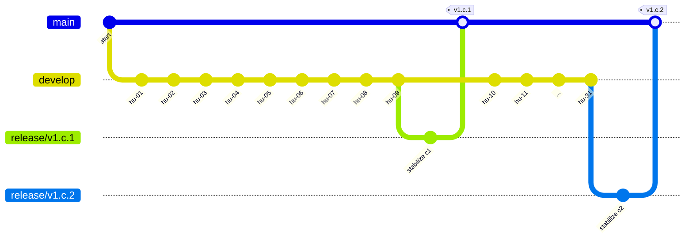

# diagrama del flujo de trabajo (mermaid)

> puedes pegar este bloque en tu readme o en cualquier visor compatible con mermaid.

```mermaid
gitGraph
   commit id: "start"
   branch develop
   commit id: "hu-01"
   commit id: "hu-02"
   commit id: "hu-03"
   commit id: "hu-04"
   commit id: "hu-05"
   commit id: "hu-06"
   commit id: "hu-07"
   commit id: "hu-08"
   commit id: "hu-09"
   branch release/v1.c.1
   commit id: "stabilize c1"
   checkout main
   merge release/v1.c.1 tag: "v1.c.1"
   checkout develop
   commit id: "hu-10"
   commit id: "hu-11"
   commit id: "..."
   commit id: "hu-31"
   branch release/v1.c.2
   commit id: "stabilize c2"
   checkout main
   merge release/v1.c.2 tag: "v1.c.2"
```
