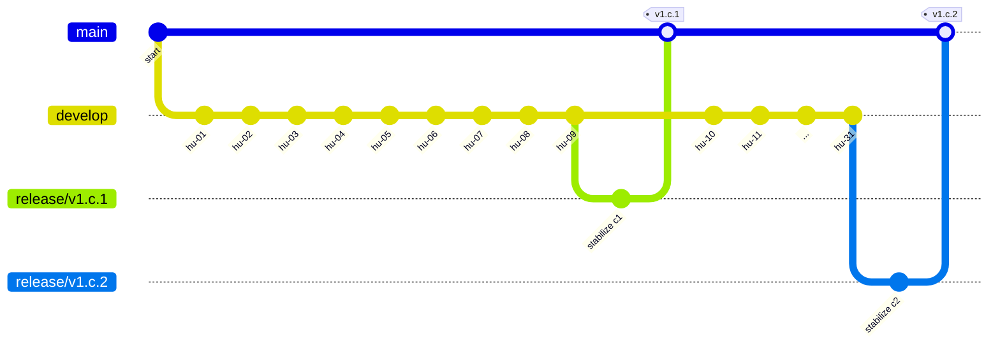

# flujo de trabajo git (incremental) — guía corta

> objetivo: documentar un flujo simple e incremental con `develop`, `qa` y `main`, ramas por historia de usuario (hu), convenciones de commits y releases por “cortes”.

---

## activity

| semana | foco | metas | criterios de salida |
|---|---|---|---|
| 01-week | implementación inicial de hu-01…hu-04 | 4 hu listas en `develop`, 4 pr revisadas, pruebas unitarias base | `develop` verde, build qa lista, checklist de code review completo |
| 02-week | completar hu-05…hu-09 y preparar corte | 5 hu listas en `develop`, smoke en `qa` | release `v1.c.1` creado desde `develop` y fusionado a `main` |

> de acuerdo con lo anterior, `develop` siempre avanza de forma incremental (feat, fix, hu-xx). cada hu pasa por `develop → qa → release → main`.

---

## ramas principales

- `develop`: integración diaria de funcionalidades.
- `qa`: estabilización y validación funcional.
- `main`: código aprobado para producción.

---

## ramas por historia de usuario

> convención sugerida (minúsculas): `hu-<n>-dev` y `hu-<n>-qa`  
> alias compatibles con tu borrador: `HU-01-dev`, `HU-01-qa` (puedes seguir usándolos; la guía estandariza en minúsculas).

| rama | se crea desde | se fusiona a | propósito |
|---|---|---|---|
| `hu-01-dev` | `develop` | `develop` | desarrollo de la hu-01 |
| `hu-01-qa`  | `qa`      | `qa`      | verificación de la hu-01 en qa |

flujos típicos:
- `hu-01-dev ← develop`  
- `hu-01-dev → develop` (via pr)
- `hu-0..-dev ← develop`  
- `hu-0..-dev → develop` (para hu 09 y hu 10–31 en iteraciones siguientes)

en `qa`:
- `hu-01-qa ← qa`
- `hu-01-qa → qa`

---

## convenciones de commits (conventional commits + id hu)

- `feat(hu-01): descripción corta`
- `fix(hu-03): corregir validación …`
- `docs(hu-02): actualizar readme`
- `chore, refactor, test` según aplique

mensajes útiles (máx 72 caracteres en el encabezado). añade detalle en el cuerpo si es necesario.

---

## cortes y releases

**nota:** el primer corte llega hasta **hu-09**.

### release `v1.c.1`
- incluye: `hu-01` … `hu-09`
- flujo:
  1) crear rama de release desde `develop`  
     `git checkout -b release/v1.c.1 develop`
  2) agregar commits de estabilización si aplica  
     `git commit -m "chore(release): preparar v1.c.1"`
  3) fusionar a `main` (pr)  
     `git checkout main && git merge --no-ff release/v1.c.1`
  4) tag de versión  
     `git tag -a v1.c.1 -m "corte 1: hu 01–09"`
  5) volver a `develop` y fusionar cambios de release si hubo ajustes  
     `git checkout develop && git merge --no-ff release/v1.c.1`

resumen:
- `release.v.1.c.1 ← main` (creas pr hacia main)
- `release.v.1.c.1` (commit de hu-01)
- `release.v.1.c.1` (commit de hu-02)
- …
- `release.v.1.c.1` (commit de hu-09)
- `release.v.1.c.1 → main`

### release `v1.c.2`
- incluye: `hu-10 … hu-31`
- flujo igual al anterior:
  - `release.v.1.c.2 ← main` (pr hacia main)
  - commits de hu-10, hu-11 … hu-31
  - `release.v.1.c.2 → main`

en `main`:
- merge de `release.v.1.c.1`
- merge de `release.v.1.c.2`

---

## diagrama (vista rápida)



---

## política de pr y validaciones

- todo merge a `develop`, `qa` y `main` pasa por pr con al menos 1 aprobador.
- checks automáticos: build, lint, unit tests.
- `qa` requiere smoke suite y checklist funcional.
- `main` requiere tag y changelog.

---

## ejemplos de comandos

```bash
# crear rama de desarrollo para la hu-01
git checkout develop
git pull
git checkout -b hu-01-dev

# commit con convención
git add .
git commit -m "feat(hu-01): crear endpoint de consulta"

# abrir pr hacia develop, revisar y fusionar (en la forja)

# preparar rama qa para la hu-01 (si se usa rama dedicada)
git checkout qa
git pull
git checkout -b hu-01-qa
# traer cambios de develop para pruebas
git merge --no-ff develop

# crear release del primer corte
git checkout develop
git checkout -b release/v1.c.1
# estabilizar, luego pr hacia main, taggear y volver a develop
```

---

## glosario rápido

- **hu**: historia de usuario (e.g., `hu-09`).
- **corte**: agrupación de hu para un release.
- **release**: publicación etiquetada (`v1.c.1`, `v1.c.2`).

---

## historial resumido del caso

- corte 1: `hu-01` a `hu-09` → `release v1.c.1` → merge en `main`.
- corte 2: `hu-10` a `hu-31` → `release v1.c.2` → merge en `main`.

---

## cambios vs tu borrador

- se corrigió “realease” a **release** y se estandarizó en minúsculas.
- se estructuró por secciones (activity, ramas, commits, releases, pr).
- se añadió tabla por semanas, convenciones de commits y comandos ejemplo.
- se incluyó diagrama `mermaid` para visualizar merges.
