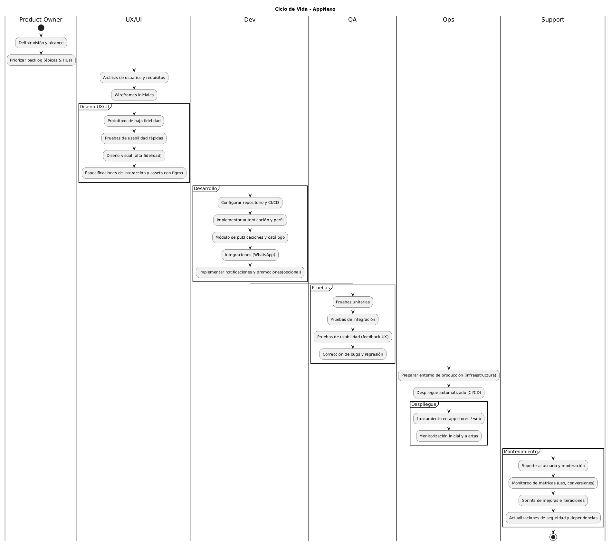

#                             App De Apoyo A Negocios Universitarios

## Identificación Del Contexto Y Problema:

En la universidad, muchos estudiantes buscan formas de generar ingresos para cubrir sus gastos de matrícula, transporte, materiales o alimentación. Sin embargo, aunque algunos tienen pequeños emprendimientos (venta de comida casera, accesorios, ropa, servicios como tutorías o reparaciones), carecen de un espacio centralizado donde dar visibilidad a sus productos o servicios. Actualmente dependen de redes sociales dispersas o el voz a voz, lo que limita su alcance y sus posibilidades de crecimiento.

## Justificación De La Aplicación Móvil:

Una aplicación móvil pensada para estudiantes universitarios sería una solución práctica y accesible, ya que serviría como un mercado digital interno de la comunidad estudiantil. En ella, los estudiantes podrían registrar sus productos o servicios, publicar fotos, precios y promociones, y los demás compañeros tendrían un canal para contactar directamente y pagar el producto fisicamente. La app podría incluir funciones de búsqueda por categorías (alimentos, accesorios, servicios o mas), sistema de reseñas y notificaciones de promociones. Además de impulsar el emprendimiento estudiantil, fomentaría la economía colaborativa dentro de la universidad.

## Publico Objetivo:

Emprendedores: Para cualquier tipo de personas, pero va enfocado a los estudiantes de la universidad entre 18 y 28 años con emprendimientos propios, nivel tecnológico medio (manejan redes sociales y apps básicas). Su uso sería diario para publicar y gestionar ventas.

Compradores: para personas, rango de edad 16 a 30 años, con nivel tecnológico medio-alto, interesados en consumir productos locales y apoyar a sus compañeros. Su frecuencia de uso sería varias veces por semana, según la necesidad de compra.

## Definición del ciclo de vida del proyecto

@startuml
title Ciclo de Vida - AppNexo
|Product Owner|
start
:Definir visión y alcance;
:Priorizar backlog (épicas & HUs);
|UX/UI|
:Análisis de usuarios y requisitos;
:Wireframes iniciales;
|UX/UI|
partition "Diseño UX/UI" {
  :Prototipos de baja fidelidad;
  :Pruebas de usabilidad rápidas;
  :Diseño visual (alta fidelidad);
  :Especificaciones de interacción y assets con figma;
}
|Dev|
partition "Desarrollo" {
  :Configurar repositorio y CI/CD;
  :Implementar autenticación y perfil;
  :Módulo de publicaciones y catálogo;
  :Integraciones (WhatsApp);
  :Implementar notificaciones y promociones(opcional);
}
|QA|
partition "Pruebas" {
  :Pruebas unitarias;
  :Pruebas de integración;
  :Pruebas de usabilidad (feedback UX);
  :Corrección de bugs y regresión;
}
|Ops|
:Preparar entorno de producción (infraestructura);
:Despliegue automatizado (CI/CD);
|Ops|
partition "Despliegue" {
  :Lanzamiento en app stores / web;
  :Monitorización inicial y alertas;
}
|Support|
partition "Mantenimiento" {
  :Soporte al usuario y moderación;
  :Monitoreo de métricas (uso, conversiones);
  :Sprints de mejoras e iteraciones;
  :Actualizaciones de seguridad y dependencias;
}
stop
@enduml

## En el trello se colocaron estas 5 tareas 

## Identificación del problema:
Tarea: Redactar documento de diagnóstico que describa el problema principal que la app busca resolver (falta de visibilidad para emprendedores, dificultad de contacto entre compradores y vendedores, etc.).

## Análisis de mercado.
Tarea: Investigar apps similares, identificar necesidades del público objetivo y analizar tendencias en comercio digital en la universidad pero también a el mundo.

## Selección de plataforma y tipo de app.
Tarea: Evaluar opciones tecnológicas (web, móvil nativa, híbrida) y seleccionar la más adecuada según el público, presupuesto y escalabilidad.

## Creación de wireframes iniciales.
Tarea: Diseñar la estructura visual básica de la app (pantallas de registro, perfil, catálogo, publicación, etc.) usando herramientas como Figma.

## Reunión de validación.
Tarea: Organizar reunión con stakeholders (usuarios, docentes, equipo técnico) para presentar avances y recibir retroalimentación.

