# Casos de uso (explicación + especificación + diagrama) 

### 3.1 ¿Qué es un caso de uso?

Una descripción de interacciones entre actores y el sistema para conseguir un objetivo de negocio.  
Útil para detallar flujos y excepciones.

### 3.2 Especificación de caso de uso

| Campo                     | Descripción |
|----------------------------|-------------|
| **ID**                     | UC-01 |
| **Nombre**                 | Registrar cuenta |
| **Actor primario**         | Estudiante / Emprendedor |
| **Interesados**            | Usuario (acceso), Soporte (reducción de incidencias) |
| **Precondiciones**         | La app está instalada |
| **Postcondiciones (éxito)**| Usuario registrado con estado “pendiente” y token enviado a correo institucional |
| **Postcondiciones (fallo)**| Mensaje de error si el correo no es válido o ya existe |
| **Flujo principal**        | 1. Usuario ingresa correo institucional, teléfono, nombre de usuario/empresa y contraseña. 2. Si es válido, se crea el registro con estado “pendiente” y se envía token de verificación. |
| **Extensiones**            | • Correo ya registrado → mostrar error. • Correo con dominio inválido → mostrar error. |
| **Reglas de negocio**      | • El correo debe contener dominio @corhuila.edu.co. • Contraseña ≥ 8 caracteres. |
| **RF/RNF relacionados**    | • RF1, RF2, RF3 • RNF1 • RS1, RS3 |

| Campo                     | UC-02: Iniciar sesión |
|----------------------------|----------------------|
| **ID**                     | UC-02 |
| **Nombre**                 | Iniciar sesión |
| **Actor primario**         | Estudiante / Emprendedor |
| **Interesados**            | Usuario (acceso), Soporte |
| **Precondiciones**         | Usuario registrado y app instalada |
| **Postcondiciones (éxito)**| Sesión activa, acceso a pantalla principal |
| **Postcondiciones (fallo)**| Mensaje de error, posibilidad de reintento |
| **Flujo principal**        | 1. Usuario ingresa correo y contraseña. 2. Sistema valida credenciales. Si son correctas, se crea sesión y redirige a pantalla inicio. |
| **Extensiones**            | • Credenciales inválidas → mostrar error. • 5 intentos fallidos → bloqueo temporal. |
| **Reglas de negocio**      | • Solo usuarios registrados pueden iniciar sesión. |
| **RF/RNF relacionados**    | • RF5 • RNF1 • RS2, RS3 |

| Campo                     | UC-03: Crear empresa |
|----------------------------|--------------------|
| **ID**                     | UC-03 |
| **Nombre**                 | Crear empresa |
| **Actor primario**         | Emprendedor |
| **Interesados**            | Usuario (perfil completo) |
| **Precondiciones**         | Usuario activo |
| **Postcondiciones (éxito)**| Empresa creada y disponible para agregar productos |
| **Postcondiciones (fallo)**| No se crea la empresa; se muestra mensaje de error por datos inválidos o empresa existente |
| **Flujo principal**        | 1. Emprendedor inicia sesión. 2. Selecciona “Crear empresa”. 3. Ingresa nombre, descripción, foto, contacto y categoría asignada. Sistema valida datos y crea empresa. |
| **Extensiones**            | • Usuario ya tiene empresa → mostrar error. • Datos incompletos → mostrar mensaje de validación. |
| **Reglas de negocio**      | • Cada usuario solo puede tener una empresa registrada. • La categoría debe existir previamente. |
| **RF/RNF relacionados**    | • RF6, RF10 • RNF1 • RS4 |

| Campo                     | UC-04: Publicar producto o servicio |
|----------------------------|--------------------|
| **ID**                     | UC-04 |
| **Nombre**                 | Publicar producto o servicio |
| **Actor primario**         | Emprendedor |
| **Interesados**            | Usuario |
| **Precondiciones**         | Emprendedor con empresa creada |
| **Postcondiciones (éxito)**| Producto asociado a empresa creado y visible en catálogo |
| **Postcondiciones (fallo)**| Producto no creado; se muestra mensaje de error por datos inválidos. |
| **Flujo principal**        | 1. Emprendedor accede a su empresa. 2. Selecciona “Agregar producto/servicio”. 3. Ingresa título, descripción, precio e imagen. Sistema valida datos y crea el producto asociado a la empresa. |
| **Extensiones**            | • Imagen no válida → mostrar error. • Precio negativo → mostrar mensaje de validación. |
| **Reglas de negocio**      | • El producto debe estar vinculado a una empresa existente. • La imagen debe pesar ≤ 5MB. |
| **RF/RNF relacionados**    | • RF8, RF10 • RNF3 • RS4 |

| Campo                     | UC-05: Ver catálogo de empresa |
|----------------------------|--------------------|
| **ID**                     | UC-05 |
| **Nombre**                 | Ver catálogo de empresa |
| **Actor primario**         | Comprador |
| **Interesados**            | Usuario |
| **Precondiciones**         | Usuario registrado |
| **Postcondiciones (éxito)**| Listado de productos de la empresa visible |
| **Postcondiciones (fallo)**| No se muestran productos; mensaje “No hay productos disponibles” |
| **Flujo principal**        | 1. Comprador selecciona un emprendimiento del catálogo general. 2. Sistema muestra los productos asociados a esa empresa con foto, nombre y precio. |
| **Extensiones**            | Empresa sin productos → mostrar mensaje “No hay productos disponibles”. |
| **Reglas de negocio**      | • Solo se muestran productos activos y aprobados. • El catálogo debe cargarse en ≤ 3 segundos. |
| **RF/RNF relacionados**    | • RF11, RF12, RF13 • RNF2 |

| Campo                     | UC-06: Contactar emprendedor |
|----------------------------|-----------------------------|
| **ID**                     | UC-06 |
| **Nombre**                 | Contactar emprendedor |
| **Actor primario**         | Comprador |
| **Interesados**            | Usuario |
| **Precondiciones**         | Producto visible |
| **Postcondiciones (éxito)**| Redirección a WhatsApp con el número del emprendedor |
| **Postcondiciones (fallo)**| No se abre WhatsApp; se muestra mensaje de error o alternativa |
| **Flujo principal**        | 1. Comprador presiona “Contactar”. 2. Sistema abre WhatsApp usando wa.me/{phone}. |
| **Extensiones**            | • Número no disponible → mostrar error. • WhatsApp no instalado → mostrar mensaje alternativo. |
| **Reglas de negocio**      | Solo se permite contactar si tiene productos el emprendedor. |
| **RF/RNF relacionados**    | • RF14 • RS3 |

| Campo                     | UC-07: Crear promoción |
|----------------------------|-----------------------|
| **ID**                     | UC-07 |
| **Nombre**                 | Crear promoción |
| **Actor primario**         | Emprendedor |
| **Interesados**            | Usuario |
| **Precondiciones**         | Producto creado |
| **Postcondiciones (éxito)**| Promoción ligada al producto visible |
| **Postcondiciones (fallo)**| Promoción no creada; se muestra mensaje de error por fechas o datos inválidos |
| **Flujo principal**        | 1. Emprendedor selecciona producto. 2. Ingresa descripción, precio en oferta, fecha inicio y fin. Sistema valida datos y crea promoción. |
| **Extensiones**            | • Fecha fin anterior a fecha inicio → mostrar error. • Precio en oferta mayor al precio original → mostrar advertencia. |
| **Reglas de negocio**      | • La promoción debe estar ligada a un producto existente. • Las fechas deben estar en formato válido. |
| **RF/RNF relacionados**    | • RF16 • RNF1 • RS4 |

| Campo                     | UC-08: Gestionar categorías |
|----------------------------|----------------------------|
| **ID**                     | UC-08 |
| **Nombre**                 | Gestionar categorías |
| **Actor primario**         | Administrador |
| **Interesados**            | Los dueños de la App Nexo |
| **Precondiciones**         | Usuario administrador activo |
| **Postcondiciones (éxito)**| Categoría creada/actualizada/eliminada y disponible para empresas |
| **Postcondiciones (fallo)**| Acción no realizada; se muestra mensaje de error por nombre repetido o categoría en uso |
| **Flujo principal**        | 1. Admin selecciona “Crear/Editar/Eliminar categoría”. 2. Ingresa nombre de categoría. Sistema valida datos y realiza acción correspondiente. |
| **Extensiones**            | • Nombre repetido → mostrar error. • Categoría en uso → advertencia antes de eliminar. |
| **Reglas de negocio**      | • Solo el administrador puede realizar esta acción. • El nombre debe tener al menos 3 caracteres. |
| **RF/RNF relacionados**    | • RF10, RF18 • RS4 |

| Campo                     | UC-09: Moderar usuarios y publicaciones |
|----------------------------|----------------------------------------|
| **ID**                     | UC-09 |
| **Nombre**                 | Modera usuarios y publicaciones |
| **Actor primario**         | Administrador |
| **Interesados**            | Los dueños de la App Nexo |
| **Precondiciones**         | Usuario administrador activo |
| **Postcondiciones (éxito)**| Usuario emprendedor suspendido correctamente |
| **Postcondiciones (fallo)**| Acción no realizada; se muestra mensaje de error por permisos o validación |
| **Flujo principal**        | 1. Administrador accede al panel de moderación. 2. Visualiza listado de empresas y comentarios. 3. Selecciona acción: suspender cuenta emprendedor. Sistema valida permisos y ejecuta la acción. |
| **Extensiones**            | • Acción no permitida → mostrar error. • Empresa ya suspendida → mostrar advertencia. |
| **Reglas de negocio**      | • Solo el administrador puede realizar estas acciones. |
| **RF/RNF relacionados**    | • RF17, RF18 • RS4 |

| Campo                     | UC-10: Gestionar reseñas |
|----------------------------|--------------------------|
| **ID**                     | UC-10 |
| **Nombre**                 | Gestionar reseñas |
| **Actor primario**         | Comprador |
| **Interesados**            | Compradores, Emprendedores, Administrador |
| **Precondiciones**         | Usuario comprador activo; producto publicado y visible en el catálogo |
| **Postcondiciones (éxito)**| La reseña queda registrada y asociada al producto, visible en el catálogo |
| **Postcondiciones (fallo)**| La reseña no se guarda; el sistema muestra mensaje de error (ej. comentario vacío, calificación fuera de rango) |
| **Flujo principal**        | 1. El comprador selecciona un producto publicado. 2. Hace clic en “Dejar reseña”. 3. Ingresa comentario. 4. Opcional: marca la reseña como reporte e indica motivo. 5. El sistema guarda la reseña y la muestra en la publicación (y si hay reporte, lo envía al administrador en estado pendiente). |
| **Extensiones**            | • Comentario vacío → mostrar error. • Si el comprador ya dejó una reseña, puede editarla o eliminarla. |
| **Reglas de negocio**      | • El comentario no puede estar vacío. • Cada comprador puede dejar solo una reseña por producto (editable/eliminable). • Si se marca como reporte, el sistema debe notificar al administrador. |
| **RF/RNF relacionados**    | • RF15, RF17 • RS4 |

---

### 3.3 Diagrama de casos de uso (PlantUML)

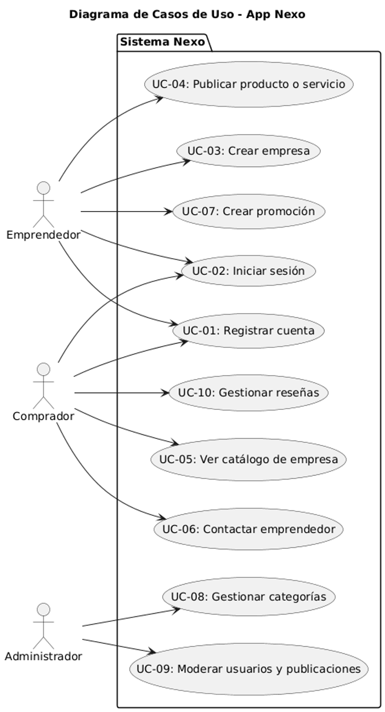

---

### 3.4 Diagrama de actividad del UC-02 (opcional)

#### UC-01: Registrar cuenta
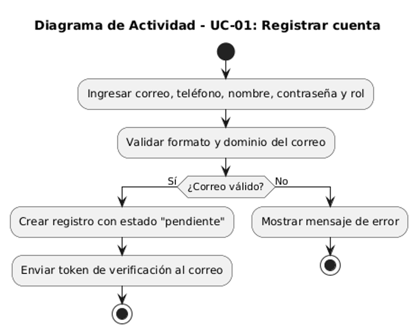

#### UC-02: Iniciar sesión
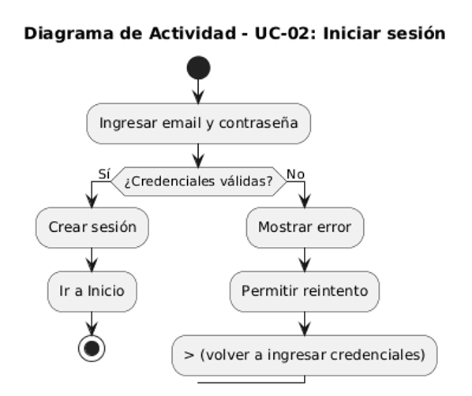

#### UC-03: Crear empresa
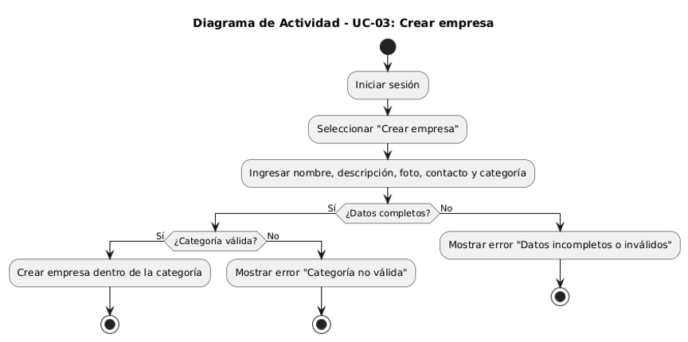

#### UC-04: Publicar producto o servicio
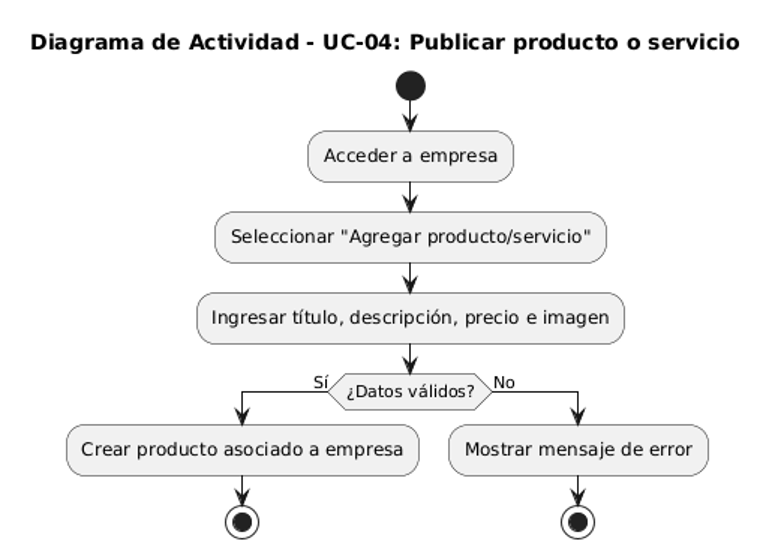

#### UC-05: Ver catálogo de empresa
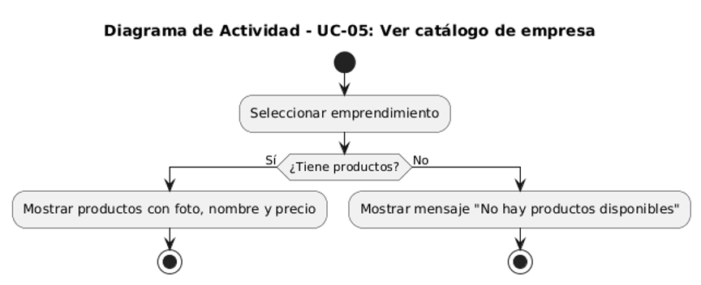

#### UC-06: Contactar emprendedor
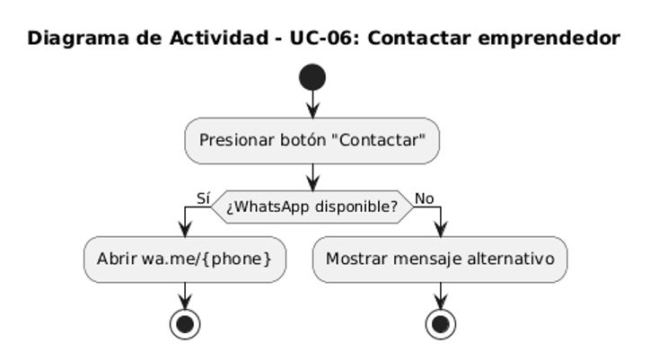

#### UC-07: Crear promoción
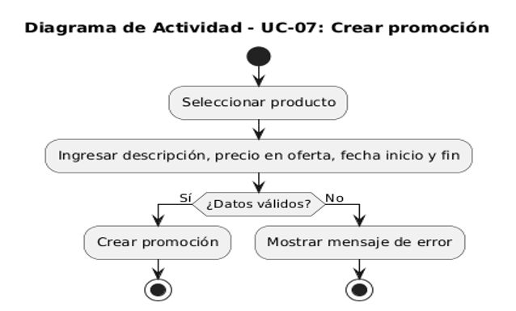

#### UC-08: Gestionar categorías
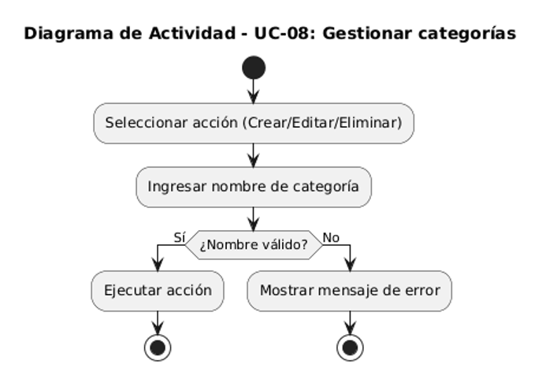

#### UC-09: Moderar usuarios y publicaciones
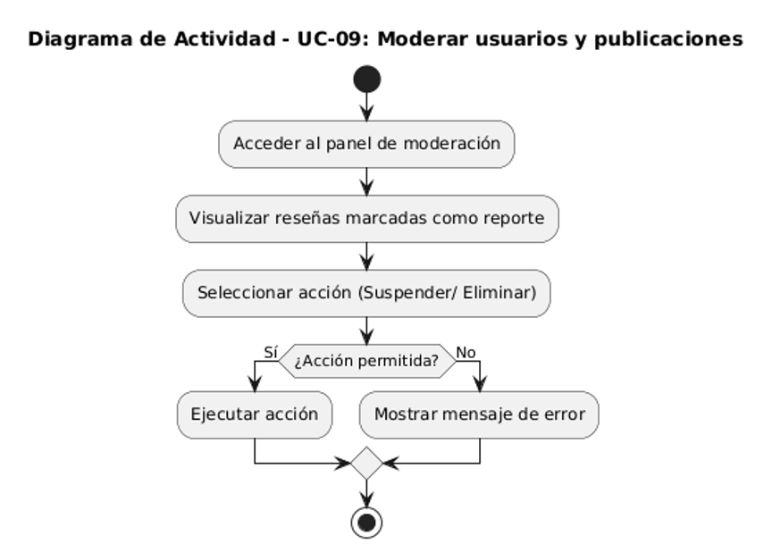

#### UC-10: Gestionar reseñas
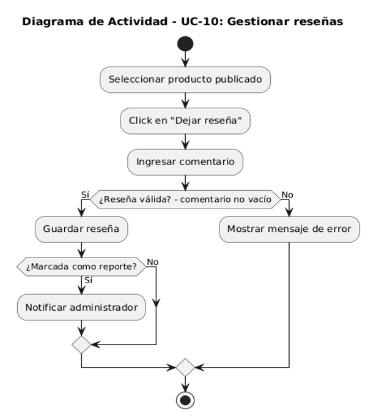

Fecha: 8 de septiembre del 2025. 
Versión: ??   
Responsable: Harold Camilo Barrera Giraldo y Danay Mariana Pereira Ospina.