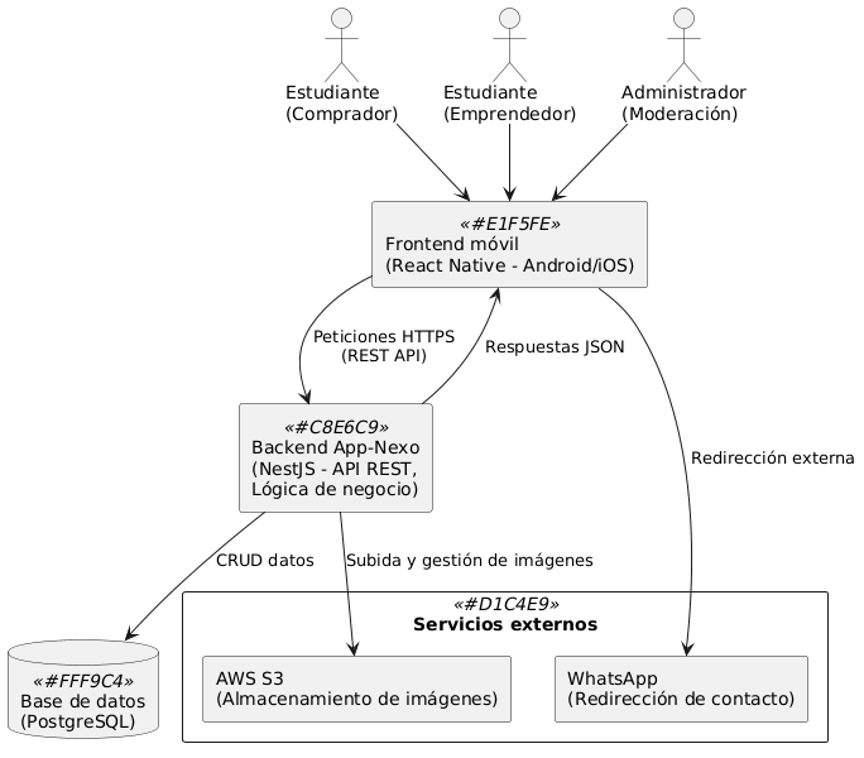

# Entregable principal — SRS (IEEE 830)

## 1.1 Introducción

### 1.1.1 Propósito - ¿Para quién es el SRS y qué objetivo tiene?
Especificar de manera clara, completa y verificable el comportamiento, interfaces, restricciones y criterios de aceptación de la aplicación móvil “App-Nexo”, un marketplace interno para estudiantes de la Universidad de Corhuila que desean publicar, reservar y entregar productos o servicios dentro del campus sin utilizar pasarela de pago. El SRS servirá como base única para el diseño, la implementación, las pruebas y la entrega de las 17 HU del producto (historias de usuario) establecidos en el backlog del proyecto.

### 1.1.2 Alcance - Qué hace (y qué no) el sistema.
La aplicación permite registro/login con correo institucional, gestión de perfiles, publicación y edición/eliminación de productos o servicios, navegación por catálogo con categorías, contacto con emprendedores vía WhatsApp, reseñas y creación de promociones. No incluye pagos en línea, integración con redes sociales, métricas de ventas ni gestión de entregas físicas.

### 1.1.3 Definiciones, acrónimos y abreviaturas
RF: Requisito Funcional. Describe lo que el sistema debe hacer.  
RNF: Requisito No Funcional. Describe restricciones o cualidades del sistema (rendimiento, seguridad, etc.).  
HU: Historia de Usuario. Forma de expresar necesidades desde la perspectiva del usuario final.  
UC: Caso de Uso. Describe la interacción entre un actor y el sistema para lograr un objetivo.  
TC: Test Case (Caso de Prueba). Conjunto de pasos definidos para validar un requisito.  
API REST: Interfaz de programación que permite la comunicación entre la aplicación móvil y el backend usando el estilo REST.  
DB (Database): Base de datos. En este proyecto se utiliza PostgreSQL.  
AWS S3: Amazon Web Services – Simple Storage Service. Servicio en la nube para almacenar imágenes de productos y perfiles.  
WhatsApp: Aplicación de mensajería usada para redirigir al comprador hacia el emprendedor.  
React Native: Framework de desarrollo para aplicaciones móviles multiplataforma.  
NestJS: Framework de Node.js usado para construir el backend del sistema.  
Token de verificación: Código único generado y enviado al correo del usuario para validar registro o recuperación de contraseña.  
JWT (JSON Web Token): Estándar de token en formato JSON usado para autenticación segura en aplicaciones web y móviles.  
@corhuila.edu.co: Dominio institucional requerido para el registro de usuarios en la plataforma.

### 1.1.4 Referencias - Normas, documentos y enlaces.
- IEEE 830-1998 — IEEE Recommended Practice for Software Requirements Specifications (estructura base del SRS).  
- React Native — Documentación oficial: https://reactnative.dev/docs/getting-started (framework para desarrollo móvil).  
- NestJS — Documentación oficial:  https://docs.nestjs.com/ (framework backend basado en Node.js).  
- PostgreSQL — Documentación oficial: https://www.postgresql.org/docs/    (motor de base de datos relacional).  
- AWS S3 — Documentación oficial: https://docs.aws.amazon.com/  (servicio de almacenamiento de imágenes en la nube).  
- Ley 1581 de 2012 y Decreto 1377 de 2013 — Normativa colombiana sobre protección de datos personales.  

### 1.1.5 Visión general del documento - Cómo está organizado.
1) Entregable principal — SRS (IEEE 830)  
Contiene la especificación de requerimientos de software estructurada según el estándar IEEE 830, incluyendo:  
• Propósito del sistema  
• Alcance funcional  
• Definiciones y referencias  
• Descripción general del sistema  
• Requerimientos funcionales (RF)  
• Requerimientos no funcionales (RNF)  
• Requerimientos de seguridad (RS)  
• Requerimientos de interfaz (RI)  
• Interfaces externas (UI, API, BD, hardware)  
• Modelado de datos y consideraciones legales  

2) Historias de usuario (documentadas y trazables)  
Se presentan en formato tabla, con enfoque ágil y trazabilidad hacia los requerimientos del SRS. Incluyen:  
• Identificador y rol del usuario  
• Narrativa de la historia (como [rol], quiero [acción], para [beneficio])  
• Criterios de aceptación en formato Gherkin  
• Relación con RF/RNF/RS  
• Priorización (MoSCoW)  
• Observaciones técnicas o de validación  

3) Casos de uso (explicación + especificación + diagrama)  
Cada caso de uso está documentado con detalle y representado gráficamente. La sección incluye:  
Plantilla de especificación (ID, actor, flujo, pre/postcondiciones, reglas de negocio, extensiones)  
• Diagrama de casos de uso UML (PlantUML)  
• Diagramas de actividad por caso de uso (opcional)  
• Trazabilidad con requerimientos funcionales y de seguridad  

---

## 1.2 Descripción general

### 1.2.1 Perspectiva del producto — Sistema en su contexto (móvil, backend, APIs).
- La solución inicia como una aplicación web desarrollada en Next.js, conectada a un backend en NestJS. Posteriormente se migrará a Ionic + React para empaquetar la app móvil (Android/iOS).  
- El backend gestiona la lógica de negocio, la autenticación y la validación de usuarios, además de administrar los datos almacenados en una base de datos PostgreSQL.  
- Las imágenes (fotos de perfil, productos, servicios y promociones) se almacenan en AWS S3, garantizando escalabilidad y disponibilidad.  
- En conjunto, la arquitectura asegura comunicación en tiempo real entre la aplicación móvil y el servidor, ofreciendo una experiencia fluida para estudiantes, emprendedores y administradores.  

### 1.2.2 Funciones del producto — Lista de funciones principales (alto nivel).
- **Registro y Autenticación de Usuarios**  
Permite a los estudiantes y emprendedores registrarse con su correo institucional, iniciar sesión, recuperar contraseña y validar su identidad mediante token.  
- **Gestión de Perfil**  
Edición y personalización del perfil (foto, descripción, datos de contacto), tanto para compradores como para emprendedores.  
- **Publicación de Productos y Servicios**  
Los emprendedores pueden crear, editar o eliminar publicaciones con fotos, descripción, precio y a la categoría categoría que pertenece.  
- **Catálogo y Búsqueda**  
Los compradores pueden explorar un catálogo de productos y servicios, navegar por categorías y ver los emprendimientos disponibles.  
- **Interacción y Comunicación**  
Los compradores pueden contactar a los emprendedores vía WhatsApp, dejar reseñas y, opcionalmente, los emprendedores reciben notificaciones de interacciones.  
- **Promociones**  
Los emprendedores pueden crear y gestionar promociones temporales para atraer clientes.  
- **Administración y Seguridad**  
Los administradores pueden revisar reportes, moderar contenido y gestionar usuarios/emprendimientos inapropiados.  
- **(Opcional a futuro)**  
Integración de sistema de pagos, estadísticas de desempeño y conexión con redes sociales.  

### 1.2.3 Características de los usuarios — Perfiles, habilidades.
• Estudiantes emprendedores  
- Perfil: Jóvenes universitarios con negocios o ideas de emprendimiento.  
- Habilidades: Alfabetización digital básica/intermedia; manejo de redes sociales; conocimientos básicos en publicación de productos y servicios.  

• Estudiantes compradores  
- Perfil: Comunidad universitaria interesada en explorar y adquirir productos/servicios de sus compañeros.  
- Habilidades: Alfabetización digital básica; experiencia en navegación de apps móviles; uso frecuente de WhatsApp y plataformas de mensajería.  

• Administradores de la aplicación  
- Perfil: Personal encargado de la moderación de contenido y la seguridad dentro de la plataforma.  
- Habilidades: Conocimientos intermedios de gestión de usuarios, revisión de reportes, y control de calidad de publicaciones.  

### 1.2.4 Restricciones — Técnicas/legales/negocio (tiempo, tienda, privacidad).
- **Técnicas**  
• La aplicación debe validar correos institucionales con dominio @corhuila.edu.co.  
• El sistema debe funcionar inicialmente en dispositivos móviles Android.  
• Limitaciones de infraestructura: uso de almacenamiento en la nube para imágenes y base de datos centralizada.  

- **Legales**  
• Cumplir con la Ley de Protección de Datos Personales en Colombia (Ley 1581 de 2012).  
• Garantizar que los datos sensibles (contraseñas, correos, teléfonos) se manejen con cifrado y protocolos de seguridad.  
• Prohibición de publicaciones con contenido ilegal, ofensivo o que incumpla normas universitarias.  

- **Negocio**  
• Solo estudiantes de la institución pueden registrarse (verificación mediante correo institucional).  
• Los emprendedores deben cumplir las políticas de uso y convivencia de la universidad.  
• Tiempo de desarrollo y despliegue limitado a un semestre académico.  
• Futuras integraciones de pagos estarán sujetas a acuerdos con bancos o pasarelas de pago autorizadas.  

### 1.2.5 Supuestos y dependencias — Ej.: conectividad, API de eventos, políticas de TI.
- **Supuestos**  
• Los usuarios (estudiantes y emprendedores) cuentan con dispositivos móviles con acceso a internet.  
• Los estudiantes poseen un nivel básico de alfabetización digital para registrarse, publicar y navegar en la app.  
• El correo institucional @corhuila.edu.co se mantiene como requisito activo para el registro.  
• La institución universitaria respalda y autoriza el uso de la aplicación dentro de su comunidad.  
• Las imágenes cargadas por los usuarios no superan el tamaño máximo definido para evitar problemas de almacenamiento.  

- **Dependencias**  
• Conectividad a internet estable para registro, exploración de catálogo y envío de notificaciones.  
• Servicio de correo electrónico para verificación de cuentas y recuperación de contraseñas.  
• Integración con WhatsApp para la comunicación entre compradores y emprendedores.  
• Plataforma de almacenamiento en la nube para fotos y publicaciones.  
• Políticas de TI de la institución para garantizar seguridad y soporte en la implementación.  

---

## 1.3 Requerimientos específicos

### 1.3.1 Interfaces externas
**Interfaz de Usuario (UI)**  
• Emprendedor  
- Registro e inicio de sesión.  
- Edición de perfil (foto, descripción, datos de contacto).  
- Crear, editar y eliminar publicaciones.  
- Crear promociones.  
- Visualizar reseñas recibidas.  

• Comprador (estudiante usuario)  
- Registro e inicio de sesión.  
- Edición de perfil básico.  
- Navegar catálogo general y por categorías.  
- Ver detalle de producto/servicio con botón de contacto vía WhatsApp.  
- Dejar reseñas en productos/servicios.  

• Administrador  
- Panel de moderación con listado de usuarios y publicaciones reportadas.  
- Opciones de eliminar usuario o publicación inapropiada.  

---

**Interfaz de Programación de Aplicaciones (API)**  
Implementada en NestJS como API REST, con respuestas en formato JSON, expuesta sobre HTTPS.  

Autenticación  
• POST /api/auth/register — Registro de usuario (emprendedor o comprador).  
• POST /api/auth/login — Inicio de sesión.  
• POST /api/auth/verify — Verificación de correo.  
• POST /api/auth/recover — Recuperación de contraseña.  

Usuarios y perfiles  
• GET /api/users/{id} — Obtener perfil.  
• PUT /api/users/{id} — Editar perfil.  

Publicaciones (solo emprendedores)  
• POST /api/products — Crear producto/servicio (con fotos).  
• PUT /api/products/{id} — Editar publicación.  
• DELETE /api/products/{id} — Eliminar publicación.  
• GET /api/products?category={id} — Listar productos por categoría.  
• GET /api/products/{id} — Detalle de producto.  

Reseñas (solo compradores)  
• POST /api/products/{id}/reviews — Crear reseña.  
• GET /api/products/{id}/reviews — Listar reseñas de un producto.  

Administración (solo administrador)  
• GET /api/reports — Listar reportes recibidos.  
• DELETE /api/products/{id} — Eliminar publicación inapropiada.  
• DELETE /api/users/{id} — Eliminar usuario infractor.  

---

**Interfaz de Base de Datos (PostgreSQL)**  
• Almacenamiento estructurado de usuarios, roles, publicaciones, categorías, reseñas y reportes.  
• Uso de ORM Prisma (típico en proyectos NestJS) para gestionar consultas y relaciones.  

Ejemplo de tabla:  
Creamos un tipo de dato ENUM llamado user_role y creamos la tabla usuarios. 

CREATE TYPE user_role AS ENUM ('emprendedor', 'comprador', 'admin');

CREATE TABLE users (
id SERIAL PRIMARY KEY,
email VARCHAR(100) UNIQUE NOT NULL,
password VARCHAR(255) NOT NULL,
role user_role NOT NULL DEFAULT 'comprador',
phone VARCHAR(20),
username VARCHAR(50),
created_at TIMESTAMP DEFAULT now()
);

---

**Interfaz de Almacenamiento de Imágenes (AWS S3)**

- Las fotos de perfil y de productos se almacenarán en buckets de AWS S3.  
- El backend (NestJS) genera URLs firmadas (signed URLs) para subir y acceder a las imágenes.  
- Formato de archivo permitido: JPG, PNG.  
- Tamaño máximo por imagen: 5 MB.  

*Ejemplo de flujo:*
1. El cliente (Next.js web o Ionic en la app móvil) solicita URL de subida → `POST /api/files/upload`.  
2. Backend genera signed URL con AWS SDK.  
3. Cliente sube la imagen directamente a S3 usando esa URL.  
4. La URL final queda guardada en PostgreSQL asociada al producto o perfil.  

---

**Interfaz de Hardware**

- Dispositivo móvil con Android 8.0 o superior.  
- Cámara para subir fotos de productos/perfil (emprendedores).  
- Espacio mínimo de 50 MB para instalación y caché de imágenes.  

---

**Interfaz de Comunicaciones**

- Conectividad requerida: Wi-Fi o datos móviles (3G/4G/5G).  
- Redirección a WhatsApp mediante `wa.me/{phone}` para contacto directo comprador–emprendedor.  
- Todas las comunicaciones entre app y backend se realizan sobre **HTTPS**.  

---

### 1.3.2 Funciones del sistema (RF)

| ID    | DESCRIPCIÓN                                                                 | PRIORIDAD | CRITERIO DE ACEPTACIÓN                                                                 |
|-------|-----------------------------------------------------------------------------|------------|-----------------------------------------------------------------------------------------|
| RF-01 | El sistema debe permitir el registro de usuarios con correo institucional, teléfono, nombre, contraseña y rol. | Alta       | Dado un correo válido con dominio @corhuila.edu.co y contraseña ≥8, se crea la cuenta y se envía token. |
| RF-02 | El sistema debe validar que el correo contenga el dominio @corhuila.edu.co. | Alta       | Si el correo no contiene el dominio, el sistema rechaza el registro y muestra mensaje de error. |
| RF-03 | El sistema debe enviar un token de verificación al correo registrado y permitir activación mediante dicho token. | Alta       | Al ingresar el token recibido, la cuenta cambia a estado “activo” y permite iniciar sesión. |
| RF-04 | El sistema debe permitir recuperación de contraseña mediante enlace o token enviado al correo. | Media      | Al solicitar recuperación, se envía token/enlace y se permite restablecer la contraseña. |
| RF-05 | El sistema debe permitir iniciar sesión con correo y contraseña previamente registrados. | Alta       | Dadas credenciales válidas, el sistema permite acceso; si no, muestra error. |
| RF-06 | El usuario debe poder editar su perfil (foto, nombre, descripción, datos de contacto). | Media      | Al modificar datos válidos y guardar, los cambios se reflejan en el perfil. |
| RF-07 | El sistema debe mostrar la foto de perfil en el catálogo y en las publicaciones. | Media      | Al subir foto válida, esta aparece en el catálogo y publicaciones del usuario. |
| RF-08 | El emprendedor debe poder crear publicaciones con título, descripción, precio, foto y categoría. | Alta       | Al completar el formulario y subir imagen válida, la publicación aparece en el catálogo. |
| RF-09 | El emprendedor debe poder editar o eliminar sus publicaciones en cualquier momento. | Alta       | Al seleccionar una publicación, puede modificarla o eliminarla con confirmación. |
| RF-10 | El sistema debe permitir clasificar publicaciones en categorías (ej.: Comida, Ropa, Servicios). | Media      | Al seleccionar una categoría, la publicación se organiza correctamente en el catálogo. |
| RF-11 | El sistema debe mostrar un catálogo con todos los productos/servicios publicados. | Alta       | Al acceder al catálogo, se listan todas las publicaciones disponibles. |
| RF-12 | El usuario debe poder filtrar productos por categoría. | Media      | Al aplicar un filtro, se muestran solo los productos de esa categoría. |
| RF-13 | El catálogo debe mostrar nombre del producto, precio, foto y nombre del emprendimiento. | Alta       | Al ver el catálogo, cada publicación incluye esos cuatro elementos visibles. |
| RF-14 | El sistema debe incluir un botón en cada publicación que redirija a WhatsApp del emprendedor. | Alta       | Al presionar “Contactar”, se abre WhatsApp con el número del emprendedor. |
| RF-15 | El comprador debe poder dejar una reseña con comentario en una publicación. | Alta       | Al completar reseña válida, esta se guarda y aparece en el producto. |
| RF-16 | El emprendedor debe poder crear promociones con campo de vigencia (fecha inicio – fecha fin). | Media      | Al ingresar fechas válidas y guardar, la promoción aparece vinculada al producto. |
| RF-17 | El administrador debe poder visualizar los comentarios de las publicaciones y tomar medidas. | Alta       | Al acceder al panel, se listan los reportes recibidos con opción de revisión. |
| RF-18 | El administrador debe poder suspender la cuenta de empresarios que incumplan las normas. | Alta       | Al confirmar acción, la cuenta se suspende/desactiva en el sistema. |

### 1.3.3 Rendimiento (RNF-Performance) — tiempos, concurrencia, límites

- **RNF-P01:** El tiempo de arranque de la aplicación en dispositivos de gama media no debe superar los **3 segundos (p95)**.  
- **RNF-P02:** El tiempo de respuesta para mostrar el catálogo de productos/servicios no debe superar los **800 ms** en condiciones de red 4G o WiFi estable.  
- **RNF-P03:** El tiempo de carga de imágenes almacenadas en AWS S3 no debe superar los **1.5 segundos (p95)** por recurso individual.  
- **RNF-P04:** El flujo de registro y autenticación (incluyendo verificación de token por correo) debe completarse en un máximo de **5 segundos**.  

---

### 1.3.4 Lógica de datos / base de datos — entidades y relaciones

#### **Usuario**
- Id_usuario (PK)
- Correo (ÚNICO, NOT NULL)
- Teléfono
- Nombre_Usuario
- Contraseña (NOT NULL)
- Rol (ENUM: 'emprendedor', 'comprador', 'admin')
- Estado (ENUM: 'pendiente', 'activo', 'suspendido') DEFAULT 'pendiente'
- Created_At
- Updated_At

**Conexiones:**
- 1:1 con Perfil
- 1:N con Empresa (si es emprendedor)
- 1:N con Reseña (si es comprador)
- 1:N con Reporte (como reportante)

#### **Perfil**
- Id_perfil (PK)
- Usuario_Id (FK → Usuario.Id_usuario)
- Foto_URL
- Descripción
- Contacto
- Updated_At

**Conexión:**
- 1:1 con Usuario

#### **Empresa**
- Id_empresa (PK)
- Usuario_Id (FK → Usuario.Id_usuario, UNIQUE) ← asegura que un usuario no tenga más de una empresa.
- Categoria_Id (FK → Categoría.Id_categoria)
- Nombre
- Descripción
- Foto_URL
- Contacto
- Created_At
- Updated_At

**Conexión:**
- 1:1 con Usuario (emprendedor)
- N:1 con Categoría
- 1:N con Producto

#### **Producto**
- Id_producto (PK)
- Empresa_Id (FK → Empresa.Id_empresa)
- Título
- Descripción
- Precio
- Imagen_URL
- Categoria_Id (FK → Categoría.Id_categoria)
- Created_At
- Updated_At

**Conexiones:**
- N:1 con Empresa
- N:1 con Categoría
- 1:N con Reseña
- 1:N con Reporte
- 1:N con Promoción

#### **Categoría**
- Id_categoria (PK)
- Nombre
- Created_At

**Conexión:**
- 1:N con Producto

#### **Reseña**
- Id_reseña (PK)
- Usuario_Id (FK → Usuario.Id_usuario)
- Producto_Id (FK → Producto.Id_producto)
- Comentario
- Created_At

**Conexiones:**
- N:1 con Usuario (comprador que escribe la reseña)
- N:1 con Producto

#### **Reporte**
- Id_reporte (PK)
- Reportante_Id (FK → Usuario.Id_usuario)
- Producto_Id (FK → Producto.Id_producto)
- Motivo
- Created_At

**Conexiones:**
- N:1 con Usuario (quien reporta)
- N:1 con Producto (producto reportado)

#### **Promoción**
- Id_promoción (PK)
- Producto_Id (FK → Producto.Id_producto)
- Descripción
- Precio_oferta (opcional)
- Fecha_inicio
- Fecha_fin
- Created_At

**Conexiones:**
- N:1 con Producto

---

**Flujo del Usuario Emprendedor**

**1. Registro e inicio de sesión**
- Se registra con correo institucional (@corhuila.edu.co), contraseña, teléfono, nombre de usuario.
- El sistema valida el correo → queda en estado = pendiente.
- Al verificar el correo → estado = activo.
- Inicia sesión normalmente.

**2. Creación de la empresa (Emprendedor)**
1. El emprendedor inicia sesión → si no tiene empresa se le muestra botón “Crear mi empresa”.
2. Antes de crear la empresa, debe elegir una categoría existente (ejemplo: Comidas, Tecnología, Artesanías).  
   Esa categoría fue previamente creada por un admin.
3. Llena formulario:
   - Nombre de la empresa
   - Descripción
   - Foto/logo
   - Contacto
   - Categoría (FK → Categoria.Id_categoria)

**3. Gestión de productos**
- Dentro de su empresa, ve botón “+ Agregar producto”.
- Llena formulario: título, descripción, precio, imagen, categoría.
- Puede editar o eliminar sus propios productos.

**4. Promociones**
- Desde un producto, puede activar una promoción: descripción, precio en oferta, fecha inicio/fin.
- La promoción se muestra ligada al producto.

**5. Visualización del catálogo**
- El emprendedor puede ver su catálogo público (su empresa con todos sus productos).
- Puede ver reseñas que compradores dejaron en sus productos.

**6. Restricciones**
- No puede crear categorías (solo admin).
- No puede crear más de una empresa (controlado con UNIQUE).

---

**Flujo del Usuario Admin**

**1. Registro e inicio de sesión**
- Se registra igual que cualquier usuario, pero con rol = admin.
- Al ingresar, el sistema le muestra opciones adicionales de administración.

**2. Gestión de categorías**
- Puede crear nuevas categorías (ej. Comidas, Ropa).
- Puede editar o eliminar categorías existentes.

**3. Gestión de empresas**
- Puede ver listado de todas las empresas registradas.
- Si encuentra una empresa inapropiada o con muchos reportes → puede eliminarla.  
  Gracias a ON DELETE CASCADE, al eliminar la empresa → se eliminan automáticamente sus productos, reseñas, promociones y reportes.

**4. Gestión de reportes**
- Los usuarios compradores pueden reportar productos.
- El admin revisa cada reporte (motivo, usuario reportante, producto).
- Puede:
  - Ignorar (rechazar reporte)
  - Eliminar empresa completa si la infracción es grave

**5. Gestión de usuarios**
- Puede ver usuarios (emprendedores, compradores)
- Puede suspender empresas → Estado = suspendido
- Puede reactivar cuentas si lo considera necesario

---

**Flujo del Usuario Comprador**

**1. Registro e inicio de sesión**
- Se registra con correo institucional (@corhuila.edu.co), contraseña, teléfono, nombre de usuario.
- El sistema valida el correo → queda en estado = pendiente.
- Al verificar el correo → estado = activo.
- Inicia sesión normalmente.

**2. Exploración del catálogo**
- Puede ver el catálogo general de productos y servicios publicados por emprendedores.
- Puede filtrar por categorías (ejemplo: Comida, Ropa, Tecnología)
- Cada producto se muestra con: título, descripción, precio, foto y nombre del emprendimiento

**3. Interacción con publicaciones (usuario comprador)**
- En cada publicación, puede dar clic en el botón de WhatsApp para comunicarse directamente con el emprendedor.
- Puede ver reseñas de otros compradores sobre un producto.
- Puede dejar una reseña (comentario) en un producto que haya adquirido o probado.
- Opcionalmente, dentro de la reseña puede marcar un producto como inapropiado o fraudulento (reporte).  
  En este caso, el comentario se guarda como reseña visible, pero el reporte se envía al administrador en estado pendiente para revisión.

**4. Gestión de perfil**
- Puede editar su información personal (foto, nombre, descripción, datos de contacto)
- Su foto y nombre se muestran cuando deja una reseña

**5. Restricciones**
- No puede crear categorías ni empresas
- No puede crear ni publicar productos
- No puede gestionar promociones

---

### 1.3.5 Restricciones de diseño — plataformas, SDKs, guías UI

**Plataformas soportadas:**
- La plataforma se desarrollará inicialmente en Next.js (web). En fases posteriores se realizará la migración a Ionic + React para soportar dispositivos móviles Android/iOS.
- El backend debe implementarse en NestJS (Node.js) con PostgreSQL como motor de base de datos.

**Infraestructura:**
- Almacenamiento de imágenes en AWS S3.
- Base de datos centralizada en PostgreSQL alojada en AWS (ej. RDS).

**SDKs y librerías:**
- Uso de librerías oficiales de AWS SDK para manejo de imágenes.
- Uso de React Navigation para navegación en la app móvil.
- Validación de correos y autenticación mediante librerías estándar de seguridad (ej. JWT).

**Guías de UI/UX:**
- La interfaz debe seguir las pautas de diseño de Material Design (Android) para garantizar consistencia visual.
- Formularios y botones deben cumplir con accesibilidad básica (contraste de colores, tamaño mínimo de toque ≥ 44 px).

### 1.3.6 Atributos del sistema (RNF) — seguridad, disponibilidad, mantenibilidad, portabilidad, accesibilidad
- Seguridad: credenciales cifradas en base de datos, autenticación por correo institucional, control de roles (admin/emprendedor/comprador).
- Disponibilidad: uptime ≥ 99%, tolerancia a fallos básicos en el servicio.
- Mantenibilidad: arquitectura modular en NestJS, documentación de API, separación de controladores/servicios.
- Portabilidad: despliegue en contenedores Docker, compatible con distintos proveedores de nube y entornos locales.
- Accesibilidad: interfaz intuitiva y responsive, navegación clara, soporte en dispositivos móviles y navegadores modernos.
- Base: la plataforma se desarrollará inicialmente en español (es-CO).

### 1.3.7 Requisitos de internacionalización/localización (si aplica)
- Formato de datos: uso de formato regional para fecha (DD/MM/YYYY), moneda (COP, $) y números.
- Internacionalización futura: el sistema deberá estar preparado para admitir más idiomas mediante archivos de recursos o configuración de i18n sin necesidad de reescribir el código.
- Compatibilidad de caracteres: soporte completo para Unicode (UTF-8), garantizando la correcta visualización de acentos y caracteres especiales.

### 1.3.8 Requisitos legales y de privacidad (si aplica)
- Cumplir con la Ley 1581 de 2012 y el Decreto 1377 de 2013 de Colombia sobre protección de datos personales.
- Garantizar la confidencialidad, integridad y disponibilidad de los datos sensibles de los usuarios, incluyendo correo institucional, teléfono, contraseña y datos de contacto de perfil o empresa.
- Los datos personales deben almacenarse de manera segura y cifrada (ej. contraseñas con hash bcrypt) y transmitirse únicamente mediante protocolos seguros (HTTPS).

**Consentimiento informado y manejo de datos**
- Los usuarios deben aceptar explícitamente la política de privacidad antes de registrarse.
- Las imágenes y publicaciones compartidas por los usuarios serán utilizadas exclusivamente dentro de la plataforma.

**Uso legal de la plataforma**
- Solo estudiantes de la Universidad de Corhuila pueden registrarse, usando correo institucional válido (@corhuila.edu.co).
- Queda prohibida la publicación de contenido ilegal, ofensivo, discriminatorio o que incumpla las normas internas de la universidad.
- El administrador tiene la facultad de eliminar publicaciones, empresas o usuarios que infrinjan estas normas, garantizando el cumplimiento legal y ético.

**Seguridad y privacidad en comunicaciones**
- La comunicación entre la app y el backend se realiza mediante HTTPS, protegiendo la información transmitida.
- Integraciones externas, como redirección a WhatsApp, no implican almacenamiento adicional de datos por parte de la app fuera del flujo de uso permitido.

**Almacenamiento y transferencia de datos**
- Las imágenes se almacenan en AWS S3, asegurando control de acceso mediante URLs firmadas.

---

### 1.4 Apéndices (opcional)
https://www.figma.com/design/nbyajVF3jNafcHBNPk0RiM/Sin-t%C3%ADtulo?node-id=0-1&t=6oLvp91VK13hoVMe-1

---

**Fecha:** 8 de septiembre del 2025 

**Versión:** ??  

**Responsable:** Harold Camilo Barrera Giraldo