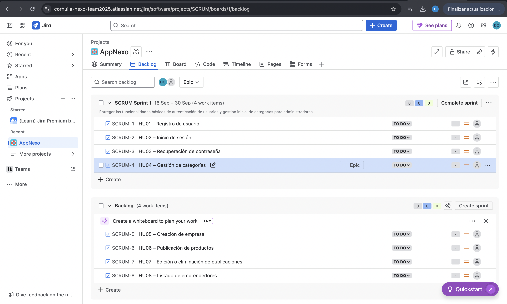
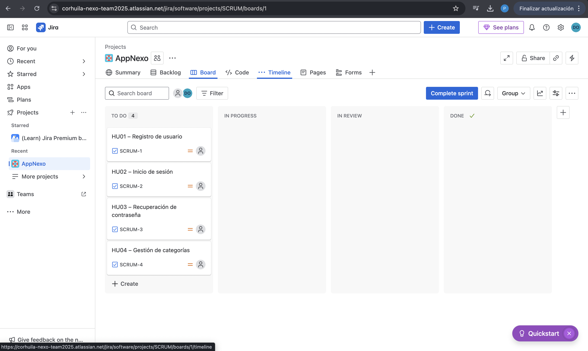

# App Nexo – Aplicación de las Metodologías Ágiles

## 1. Manifiesto Ágil aplicado al proyecto

### Valores ágiles

1. **Personas e interacciones sobre procesos y herramientas**
   La comunicación fluida entre nosotros como equipo y con los usuarios (emprendedores, compradores y administradores) será siempre más valiosa que depender únicamente de una herramienta.
   *Ejemplo:* Antes de programar el registro, conversaremos con algunos emprendedores para confirmar qué datos son realmente necesarios.

2. **Producto en funcionamiento sobre documentación extensa**
   Nuestro objetivo es mostrar avances tangibles de la app en lugar de gastar demasiado tiempo escribiendo documentación.
   *Ejemplo:* En vez de limitarse a explicar HU01 (registro), construiremos un prototipo interactivo en Figma que permita probar el flujo de registro.

3. **Colaboración con el cliente sobre negociación de contratos**
   Los estudiantes y emprendedores de Corhuila serán parte activa del proceso, por lo que sus comentarios guiarán el desarrollo.
   *Ejemplo:* Si durante la validación de HU12 (contactar por WhatsApp) nos sugieren añadir también un canal de correo, adaptaremos el backlog para responder a esa necesidad.

4. **Responder al cambio más que seguir un plan rígido**
   Si identificamos que los compradores valoran más las promociones que las reseñas, modificaremos la priorización del backlog para reflejar lo que genera mayor impacto.
   *Ejemplo:* Reorganizar los sprints en Jira para dar salida primero a la funcionalidad de promociones.

### Principios ágiles con ejemplos

* **Principio 1: Satisfacción del cliente con entregas tempranas.**
  *Aplicación:* En el Sprint 1 liberaremos las funcionalidades básicas de acceso (registro, login y recuperación de contraseña) para que los usuarios puedan empezar a interactuar con la app cuanto antes.

* **Principio 3: Entregar software frecuentemente.**
  *Aplicación:* Cada sprint tendrá como resultado una función lista para usar.
  *Ejemplo:* Sprint 2 con HU09 (listado de emprendedores), Sprint 3 con HU06 (publicar productos).

* **Principio 12: Mejora continua.**
  *Aplicación:* Tras el Sprint 4 revisaremos la experiencia de búsqueda de productos. Si los usuarios reportan dificultades, priorizaremos HU08 (categorías) para el siguiente ciclo.

---

## 2. Marco Scrum en el proyecto

### Roles

* **Product Owner:** Ambos compartimos este rol para decidir qué funcionalidades generan más valor y mantener la visión del producto.
* **Scrum Master:** Le corresponde a mi compañero liderar la aplicación de Scrum, velar por la organización de reuniones y remover bloqueos.
* **Development Team:** Los dos participamos en codificación, pruebas y diseño.

### Product Backlog (extracto)

| HU   | Usuario               | Quiero…                              | Para…                               | Prioridad | RF/RNF    |
| ---- | --------------------- | ------------------------------------ | ----------------------------------- | --------- | --------- |
| HU01 | Emprendedor/Comprador | Registrarme con correo institucional | Validar mi identidad en la app      | Alta      | RF1, RNF1 |
| HU02 | Usuario               | Iniciar sesión con correo y rol      | Acceder a funciones según mi perfil | Alta      | RF5, RNF1 |
| HU03 | Emprendedor           | Recuperar contraseña                 | No perder acceso si la olvido       | Media     | RF6       |
| HU04 | Administrador         | Administrar categorías               | Que las empresas estén organizadas  | Alta      | RF7       |
| HU05 | Emprendedor           | Crear mi empresa                     | Ofrecer productos/servicios         | Alta      | RF8       |
| HU06 | Emprendedor           | Publicar productos                   | Llegar a más compradores            | Alta      | RF9       |
| HU07 | Emprendedor           | Editar/eliminar publicaciones        | Mantener actualizadas mis ofertas   | Alta      | RF10      |
| HU08 | Comprador             | Ver lista de emprendedores           | Elegir con quién interactuar        | Alta      | RF11      |

### Sprint Backlog

Para el primer sprint (2 semanas) seleccionamos: HU01, HU02, HU03 y HU04.

### Criterios de aceptación (ejemplo HU01 – Registro)

* **Escenario exitoso:** si el usuario completa los campos obligatorios y usa correo `@corhuila.edu.co`, recibe un token de verificación y su cuenta queda pendiente de activación.
* **Escenario de activación:** al ingresar el token recibido, la cuenta cambia a estado *activo* y puede iniciar sesión.

---

## 3. Tablero Kanban

Trabajaremos con Jira configurado con las columnas:

* **To Do**
* **In Progress**
* **In Review**
* **Done**

Se definirá un límite WIP de **máximo 2 HU** en *In Progress* para evitar saturación y mantener foco. Las historias seleccionadas del Sprint Backlog se moverán en el tablero conforme avancen.

LINK JIRA: https://corhuila-nexo-team2025.atlassian.net/jira/software/projects/SCRUM/boards/1?atlOrigin=eyJpIjoiZWJkMmExZWY2NjY0NGE5NGIxNGExMDEyZjBjMjEwMDIiLCJwIjoiaiJ9 

---

## 4. Comparativa Ágil vs Tradicional

| Aspecto       | Cascada (Tradicional)                  | Ágil (Scrum/Kanban)                      |
| ------------- | -------------------------------------- | ---------------------------------------- |
| Planificación | Detallada y cerrada desde el inicio    | Iterativa, se ajusta en cada sprint      |
| Flexibilidad  | Cambiar requisitos es costoso          | Cambios frecuentes y priorizados         |
| Entregas      | Producto final hasta el último momento | Versiones funcionales en periodos cortos |
| Cliente       | Involucrado solo al inicio y final     | Retroalimentación continua               |
| Riesgos       | Detectados tarde                       | Identificados y resueltos tempranamente  |

**Más beneficioso:** Ágil, porque nuestro proyecto móvil Nexo necesita validación constante de usuarios y entregas tempranas para no perder tiempo en funciones poco útiles.

---

## 5. Plan de aplicación ágil en Nexo

Nuestro proyecto seguirá Scrum con apoyo de Kanban para la visualización de tareas. Organizaremos sprints de una o dos semanas, al final de cada uno habrá revisión con los usuarios y retrospectiva del equipo. Los avances estarán en Jira, con las HU moviéndose por las columnas del tablero según su estado. Esto nos permitirá mantener una visión clara, detectar bloqueos y mejorar continuamente con base en la retroalimentación.

