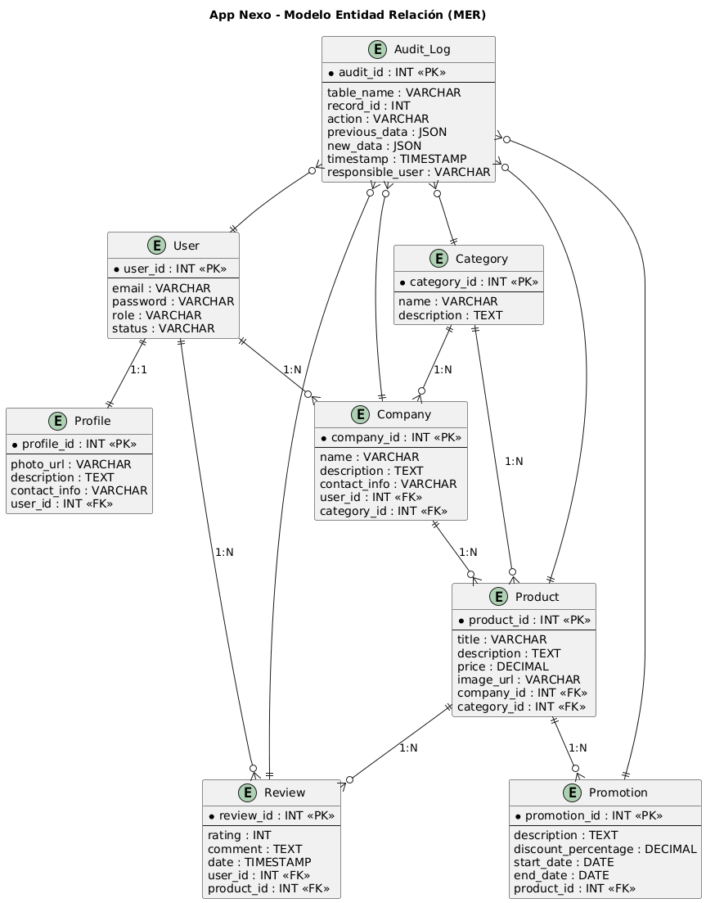

# App Nexo — Diseño de base de datos y mockups

---

## 1. Modelado de datos

Para que la aplicación funcione correctamente, es necesario organizar la información en **entidades** (tablas de base de datos) y definir cómo se relacionan entre sí. Cada entidad representa un concepto real (usuario, empresa, producto, etc.), mientras que las relaciones indican cómo interactúan en el sistema.
Además, se incluyen **tablas de auditoría** para garantizar la trazabilidad de los cambios.

---

### **User**

El **usuario** es el núcleo del sistema y puede tener rol de **entrepreneur**, **buyer** o **administrator**.

**Atributos clave:** `user_id`, `email`, `password`, `role`, `status`

**Relaciones:**

* Cada usuario tiene un único **Profile** (1:1).
* Un **entrepreneur** puede registrar varias **Company** (1\:N).
* Un **buyer** puede dejar múltiples **Review** (1\:N).

---

### **Profile**

El **perfil** almacena información pública del usuario como foto, descripción y datos de contacto.

**Atributos clave:** `profile_id`, `photo_url`, `description`, `contact_info`

**Relación:** un **User** tiene un **Profile** (1:1).

---

### **Company**

Representa un negocio creado por un estudiante. Contiene nombre, descripción, logo e información de contacto.

**Atributos clave:** `company_id`, `name`, `description`, `contact_info`

**Relaciones:**

* Una **Company** pertenece a un **entrepreneur** (1:1 con User).
* Una **Company** pertenece a una **Category** (N:1).
* Una **Company** puede tener varios **Product** (1\:N).

---

### **Product**

Elemento central del sistema: los bienes o servicios ofrecidos por los emprendedores.

**Atributos clave:** `product_id`, `title`, `description`, `price`, `image_url`

**Relaciones:**

* Un **Product** pertenece a una **Company** (N:1).
* Un **Product** pertenece a una **Category** (N:1).
* Un **Product** puede tener múltiples **Review** (1\:N).
* Un **Product** puede tener varias **Promotion** (1\:N).

---

### **Category**

Organiza el catálogo en grupos como alimentos, servicios, accesorios, etc.

**Atributos clave:** `category_id`, `name`, `description`

**Relaciones:**

* Una **Category** puede tener varias **Company** (1\:N).
* Una **Category** puede tener varios **Product** (1\:N).

---

### **Review**

Opiniones que los compradores dejan sobre los productos adquiridos.

**Atributos clave:** `review_id`, `user_id`, `product_id`, `rating`, `comment`, `date`

**Relaciones:**

* Una **Review** la escribe un **User** con rol de comprador (N:1).
* Cada **Review** pertenece a un **Product** (N:1).

---

### **Promotion**

Maneja descuentos y ofertas especiales.

**Atributos clave:** `promotion_id`, `product_id`, `description`, `discount_percentage`, `start_date`, `end_date`

**Relación:** cada **Promotion** pertenece a un **Product** (N:1).

---

### **Tabla de Auditoría General**

Permite mantener un historial de cambios en las entidades principales.

#### **Audit_Log**

* `audit_id` (PK)  
* `table_name` → nombre de la tabla afectada (ej. User, Product, Company)  
* `record_id` → identificador del registro afectado  
* `action` → tipo de acción (`INSERT`, `UPDATE`, `DELETE`)  
* `previous_data` → valores previos del registro (JSON)  
* `new_data` → valores nuevos del registro (JSON)  
* `timestamp` → fecha y hora del cambio  
* `responsible_user` → usuario responsable de la acción  


---

## 2. Selección de base de datos

La base de datos seleccionada es **PostgreSQL**, instalada en un servidor que centraliza el acceso.

**Justificación:**

* Permite sincronización multiusuario en tiempo real.
* Maneja concurrencia y transacciones seguras.
* Ofrece buen rendimiento en consultas complejas (catálogo, filtros, historial).
* Se puede complementar con **SQLite local** como caché para mejorar disponibilidad offline.

---

## 3. Creación de diagrama MER



---

## 4. Diseño de mockups y prototipos

https://www.figma.com/proto/nbyajVF3jNafcHBNPk0RiM/Sin-t%C3%ADtulo?page-id=0%3A1&node-id=1-5&viewport=13%2C264%2C0.51&t=HGTF4lFt5HbqoS1D-1&scaling=scale-down&content-scaling=fixed&starting-point-node-id=7%3A8

---

## 5. Integración entre diseño y backend

Para estandarizar la comunicación entre frontend y backend se definen contratos de datos en **JSON**.

### Ejemplo de estructuras de datos

#### **User**

```json
{
  "user_id": 1,
  "email": "example@domain.com",
  "username": "carlos123",
  "role": "entrepreneur",
  "status": "active",
  "created_at": "2025-09-12T10:30:00Z",
  "updated_at": "2025-09-12T11:00:00Z"
}
```

#### **Product**

```json
{
  "product_id": 101,
  "company_id": 5,
  "category_id": 2,
  "title": "Handmade Burger",
  "description": "100% beef, artisan bread, fresh vegetables",
  "price": 18000,
  "image_url": "https://images.com/burger.jpg",
  "created_at": "2025-09-12T10:45:00Z",
  "updated_at": "2025-09-12T11:10:00Z"
}
```

---

### Ejemplo de endpoints

#### 1. Registrar un nuevo producto

* **URL:** `/api/products`
* **Método:** `POST`
* **Descripción:** permite a un emprendedor crear un nuevo producto.

**Body (JSON):**

```json
{
  "company_id": 5,
  "category_id": 2,
  "title": "Handmade Burger",
  "description": "100% beef, artisan bread, fresh vegetables",
  "price": 18000,
  "image_url": "https://images.com/burger.jpg"
}
```

**Respuesta (201 - Created):**

```json
{
  "success": true,
  "message": "Product successfully created",
  "product": {
    "product_id": 101,
    "company_id": 5,
    "category_id": 2,
    "title": "Handmade Burger",
    "description": "100% beef, artisan bread, fresh vegetables",
    "price": 18000,
    "image_url": "https://images.com/burger.jpg",
    "created_at": "2025-09-12T10:45:00Z",
    "updated_at": "2025-09-12T10:45:00Z"
  }
}
```

---

#### 2. Obtener productos por categoría

* **URL:** `/api/products/category/:category_id`
* **Método:** `GET`
* **Descripción:** devuelve todos los productos de una categoría específica.

**Ejemplo:** `/api/products/category/2`

**Respuesta (200 - OK):**

```json
{
  "success": true,
  "category_id": 2,
  "products": [
    {
      "product_id": 101,
      "company_id": 5,
      "title": "Handmade Burger",
      "price": 18000,
      "image_url": "https://images.com/burger.jpg"
    },
    {
      "product_id": 102,
      "company_id": 7,
      "title": "Personal Pizza",
      "price": 15000,
      "image_url": "https://images.com/pizza.jpg"
    }
  ]
}
```
