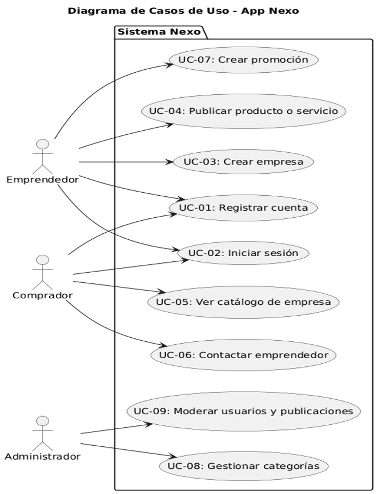
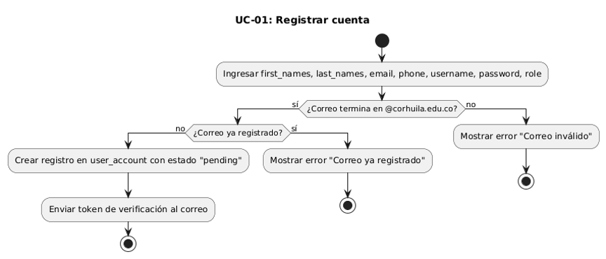
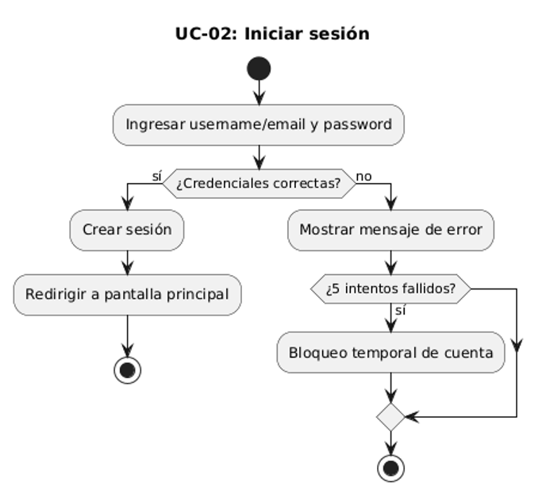
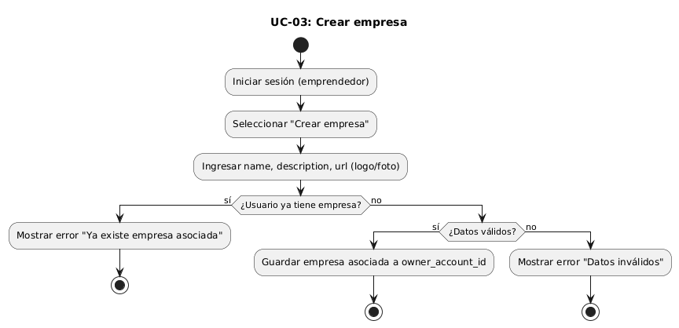
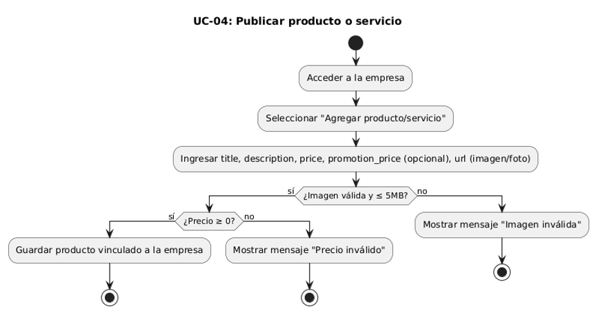
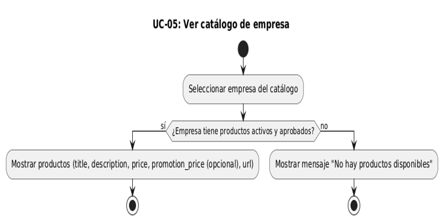
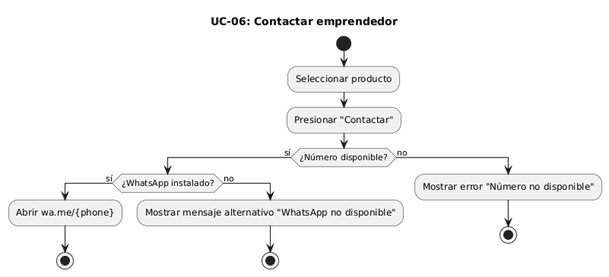
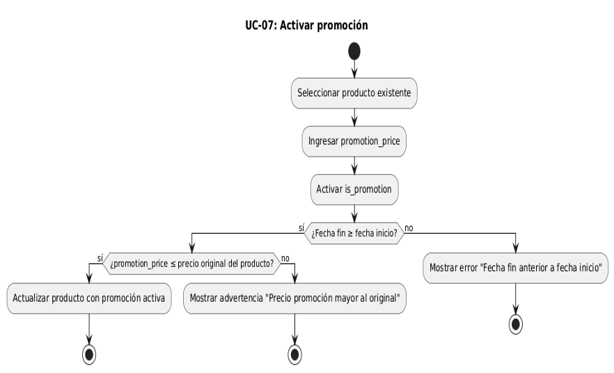
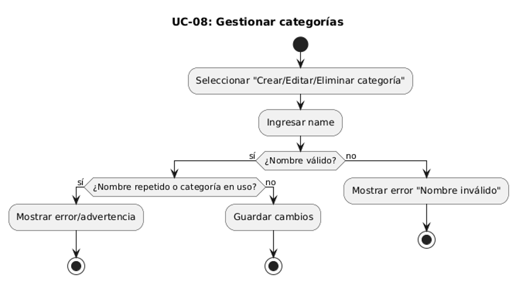
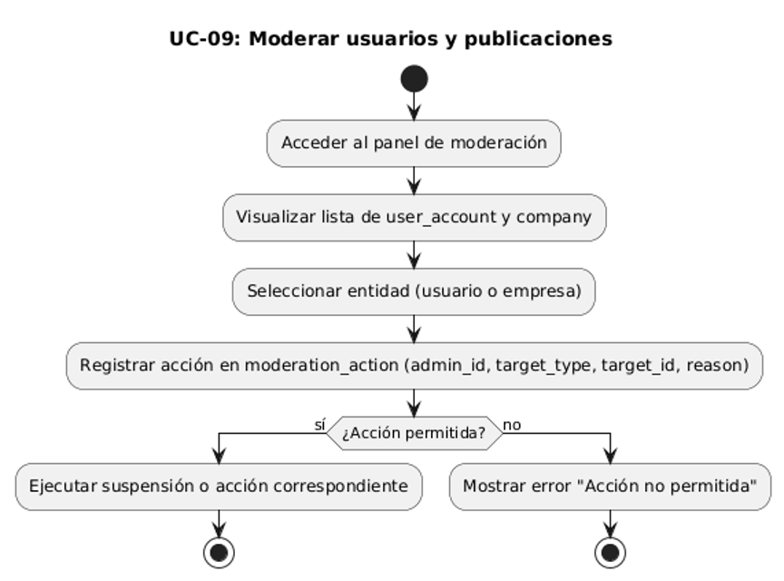

# Casos de uso (explicación + especificación + diagrama)

## 3.1 ¿Qué es un caso de uso?  
Una descripción de interacciones entre actores y el sistema para conseguir un objetivo de negocio.  
Útil para detallar flujos y excepciones.  

---

## 3.2 Especificación de casos de uso  

### UC-01: Registrar cuenta
| **Campo** | **Descripción** |
|-----------|-----------------|
| ID | UC-01 |
| Nombre | Registrar cuenta |
| Actor primario | Usuario (emprendedor o comprador) |
| Interesados | Usuario (acceso), Soporte (reducción de incidencias) |
| Precondiciones | La app está instalada |
| Postcondiciones (éxito) | Usuario registrado con estado `pending` y token enviado al correo institucional |
| Postcondiciones (fallo) | Mensaje de error si el correo no es válido o ya existe |
| Flujo principal | 1. Usuario ingresa: *first_names, last_names, email, phone, username, password y role*. 2. El sistema valida que el correo termine en **@corhuila.edu.co**. 3. Si es válido, se crea el registro en `user_account` con estado `pending` y se envía token de verificación. |
| Extensiones | • Correo ya registrado → mostrar error. • Correo con dominio inválido → mostrar error. |
| Reglas de negocio | • El correo debe contener dominio **@corhuila.edu.co**. • Contraseña ≥ 8 caracteres. |
| RF/RNF relacionados | • RF1, RF2, RF3 • RNF1 • RS1, RS3 |

---

### UC-02: Iniciar sesión
| **Campo** | **Descripción** |
|-----------|-----------------|
| ID | UC-02 |
| Nombre | Iniciar sesión |
| Actor primario | Usuario (emprendedor o comprador) |
| Interesados | Usuario (acceso), Soporte |
| Precondiciones | Usuario registrado y activo |
| Postcondiciones (éxito) | Sesión activa y acceso a funcionalidades según rol |
| Postcondiciones (fallo) | Mensaje de error, posibilidad de reintento |
| Flujo principal | 1. Usuario ingresa *username o email* y *password*. 2. El sistema valida credenciales. 3. Si son correctas, crea la sesión y redirige a pantalla principal. |
| Extensiones | • Credenciales inválidas → mostrar error. • 5 intentos fallidos → bloqueo temporal. |
| Reglas de negocio | • Solo usuarios registrados pueden iniciar sesión. |
| RF/RNF relacionados | • RF5 • RNF1 • RS2, RS3 |

---

### UC-03: Crear empresa
| **Campo** | **Descripción** |
|-----------|-----------------|
| ID | UC-03 |
| Nombre | Crear empresa |
| Actor primario | Emprendedor |
| Interesados | Usuario (perfil completo) |
| Precondiciones | Usuario activo y sin empresa asociada |
| Postcondiciones (éxito) | Empresa creada y disponible para agregar productos |
| Postcondiciones (fallo) | No se crea la empresa; mensaje de error por datos inválidos o empresa existente |
| Flujo principal | 1. Emprendedor inicia sesión. 2. Selecciona “Crear empresa”. 3. Ingresa: *name, description, url (logo/foto/imagen)*. 4. El sistema guarda la empresa asociada a su `owner_account_id`. |
| Extensiones | • Usuario ya tiene empresa → mostrar error. • Datos incompletos → mensaje de validación. |
| Reglas de negocio | • Cada usuario solo puede tener una empresa registrada. • La categoría debe existir previamente. |
| RF/RNF relacionados | • RF6, RF10 • RNF1 • RS4 |

---

### UC-04: Publicar producto o servicio
| **Campo** | **Descripción** |
|-----------|-----------------|
| ID | UC-04 |
| Nombre | Publicar producto o servicio |
| Actor primario | Emprendedor |
| Interesados | Usuario |
| Precondiciones | Producto asociado a la empresa creado y visible en catálogo |
| Postcondiciones (éxito) | Producto asociado a empresa creado y visible en catálogo |
| Postcondiciones (fallo) | Producto no creado; mensaje de error por datos inválidos |
| Flujo principal | 1. Emprendedor accede a su empresa. 2. Selecciona “Agregar producto/servicio”. 3. Ingresa: *title, description, price, promotion_price (opcional), url (imagen/foto)*. 4. El sistema guarda el producto vinculado a la empresa. |
| Extensiones | • Imagen no válida → mostrar error. • Precio negativo → mensaje de validación. |
| Reglas de negocio | • El producto debe estar vinculado a una empresa existente. • La imagen debe pesar ≤ 5MB. |
| RF/RNF relacionados | • RF8, RF10 • RNF3 • RS4 |

---

### UC-05: Ver catálogo de empresa
| **Campo** | **Descripción** |
|-----------|-----------------|
| ID | UC-05 |
| Nombre | Ver catálogo de empresa |
| Actor primario | Comprador |
| Interesados | Usuario |
| Precondiciones | Usuario registrado |
| Postcondiciones (éxito) | Listado de productos de la empresa visible |
| Postcondiciones (fallo) | No se muestran productos; mensaje “No hay productos disponibles” |
| Flujo principal | 1. Comprador selecciona una empresa del catálogo. 2. El sistema muestra productos: *title, description, price, promotion_price (opcional), url (imagen/foto)*. |
| Extensiones | • Empresa sin productos → mensaje “No hay productos disponibles”. |
| Reglas de negocio | • Solo se muestran productos activos y aprobados. • El catálogo debe cargarse en ≤ 3 segundos. |
| RF/RNF relacionados | • RF11, RF12, RF13 • RNF2 |

---

### UC-06: Contactar emprendedor
| **Campo** | **Descripción** |
|-----------|-----------------|
| ID | UC-06 |
| Nombre | Contactar emprendedor |
| Actor primario | Comprador |
| Interesados | Usuario |
| Precondiciones | Producto visible |
| Postcondiciones (éxito) | Redirección a WhatsApp con el número del emprendedor |
| Postcondiciones (fallo) | No se abre WhatsApp; mensaje de error o alternativa |
| Flujo principal | 1. Comprador selecciona un producto. 2. Presiona “Contactar”. 3. El sistema abre `wa.me/{phone}`. |
| Extensiones | • Número no disponible → mostrar error. • WhatsApp no instalado → mensaje alternativo. |
| Reglas de negocio | • Solo se permite contactar si tiene productos el emprendedor. |
| RF/RNF relacionados | • RF14 • RS3 |

---

### UC-07: Activar promoción
| **Campo** | **Descripción** |
|-----------|-----------------|
| ID | UC-07 |
| Nombre | Activar promoción |
| Actor primario | Emprendedor |
| Interesados | Usuario |
| Precondiciones | Producto con promoción activada y precio promocional actualizado |
| Postcondiciones (éxito) | Promoción ligada al producto visible |
| Postcondiciones (fallo) | Producto no actualizado; error por datos inválidos |
| Flujo principal | 1. Emprendedor selecciona un producto existente. 2. Ingresa el *promotion_price* deseado. 3. Activa la promoción mediante el campo `is_promotion`. 4. El sistema valida: • Que la fecha fin ≥ fecha inicio. • Que *promotion_price* ≤ precio original. 5. Si las validaciones pasan, se actualiza el producto con la promoción activa. |
| Extensiones | • Fecha fin anterior a inicio → error y no activar. • Precio oferta mayor al original → advertencia y no activar. |
| Reglas de negocio | • Las promociones no se crean, solo se activan/desactivan. • Las fechas deben estar en formato válido. • Solo se puede activar promoción en productos existentes (`product.id`). |
| RF/RNF relacionados | • RF15 • RNF1 • RS4 |

---

### UC-08: Gestionar categorías
| **Campo** | **Descripción** |
|-----------|-----------------|
| ID | UC-08 |
| Nombre | Gestionar categorías |
| Actor primario | Administrador |
| Interesados | Los dueños de la App Nexo |
| Precondiciones | Usuario administrador activo |
| Postcondiciones (éxito) | Categoría creada/actualizada/eliminada y disponible para empresas |
| Postcondiciones (fallo) | Acción no realizada; error por nombre repetido o categoría en uso |
| Flujo principal | 1. Admin selecciona “Crear/Editar/Eliminar categoría”. 2. Ingresa *name*. 3. El sistema guarda cambios. |
| Extensiones | • Nombre repetido → error. • Categoría en uso → advertencia antes de eliminar. |
| Reglas de negocio | • Solo el administrador puede realizar esta acción. • El nombre debe tener ≥ 3 caracteres. |
| RF/RNF relacionados | • RF10 • RS4 |

---

### UC-09: Moderar usuarios y publicaciones
| **Campo** | **Descripción** |
|-----------|-----------------|
| ID | UC-09 |
| Nombre | Moderar usuarios y publicaciones |
| Actor primario | Administrador |
| Interesados | Los dueños de la App Nexo |
| Precondiciones | Usuario administrador activo |
| Postcondiciones (éxito) | Usuario emprendedor suspendido correctamente |
| Postcondiciones (fallo) | Acción no realizada; error por permisos o validación |
| Flujo principal | 1. Admin accede al panel de moderación. 2. Visualiza lista de `user_account` y `company`. 3. Selecciona una entidad (usuario o empresa). 4. Registra acción en `moderation_action` con: *admin_id, target_type (user/company), target_id, reason*. |
| Extensiones | • Acción no permitida → error. • Empresa ya suspendida → advertencia. |
| Reglas de negocio | • Solo el administrador puede realizar estas acciones. |
| RF/RNF relacionados | • RF16 • RS4 |

---

## 3.3 Diagrama de casos de uso (PlantUML)  

---

## 3.4 Diagramas de actividad de las UC (opcional)  

#### UC-01: Registrar cuenta

---  

#### UC-02: Iniciar sesión

--- 

#### UC-03: Crear empresa

--- 

#### UC-04: Publicar producto o servicio

--- 

#### UC-05: Ver catálogo de empresa

--- 

#### UC-06: Contactar emprendedor

--- 

#### UC-07: Activar promoción

--- 

#### UC-08: Gestionar categorías

--- 

#### UC-09: Moderar usuarios y publicaciones

---

**Fecha:** 30 de septiembre del 2025  
**Versión:** #2  
**Responsables:**  
- Danay Mariana Pereira Ospina  
- Harold Camilo Barrera Giraldo