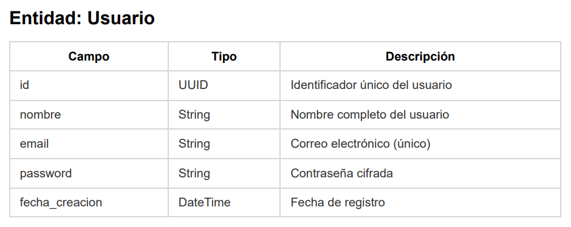
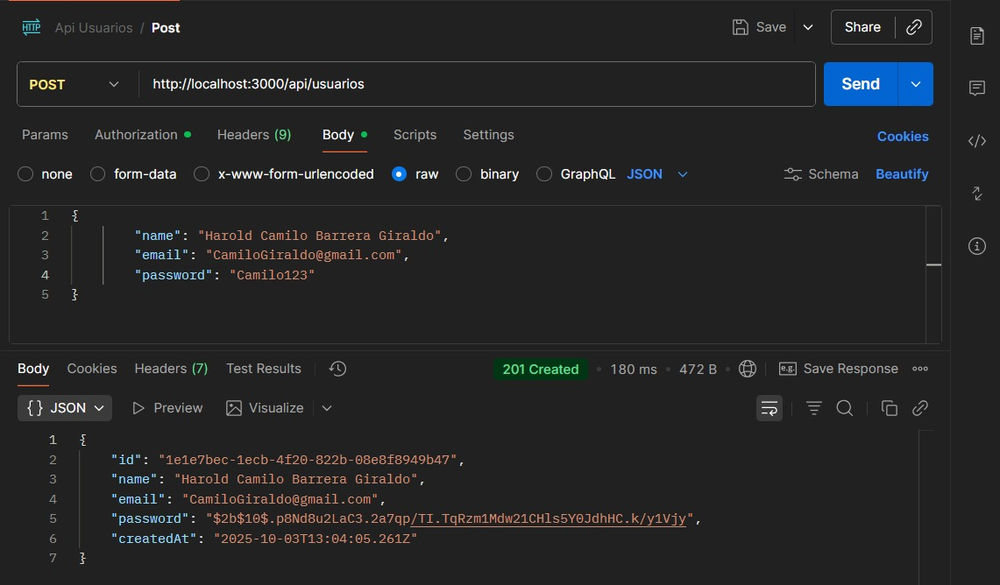
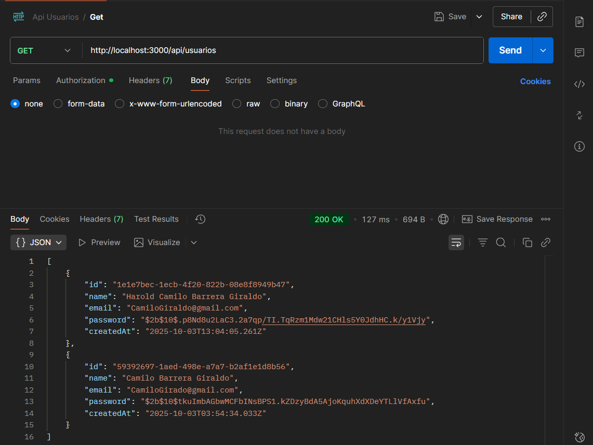
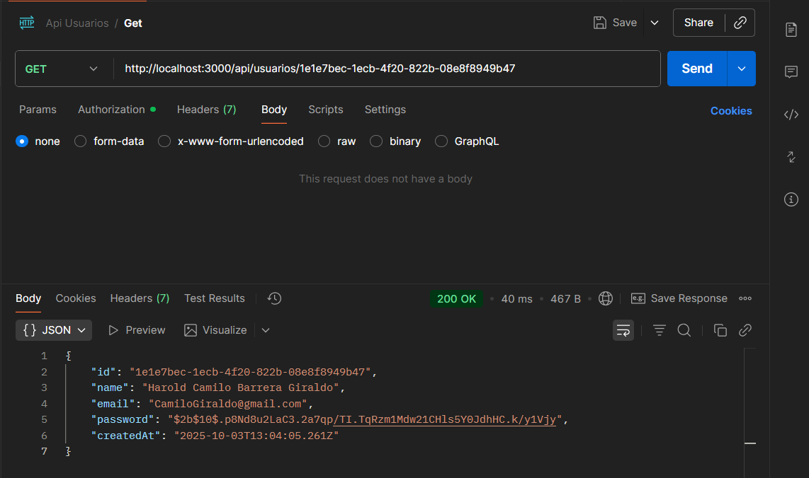
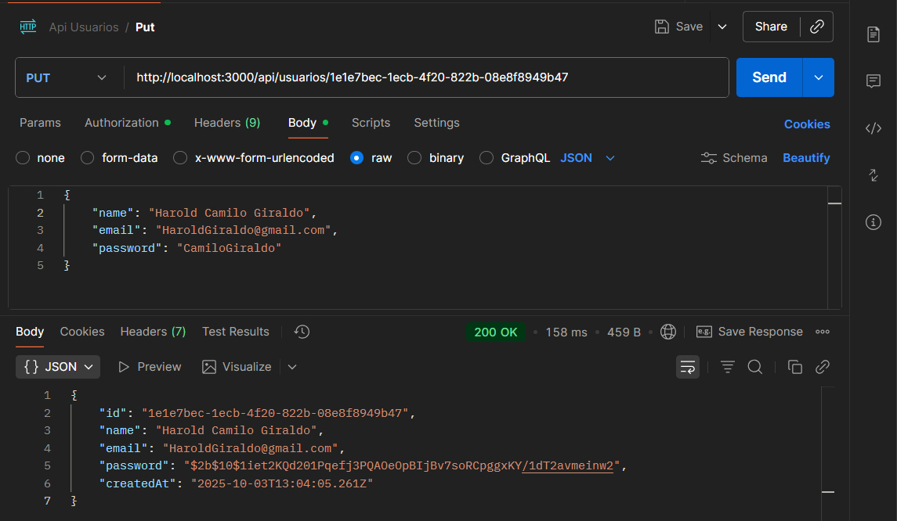
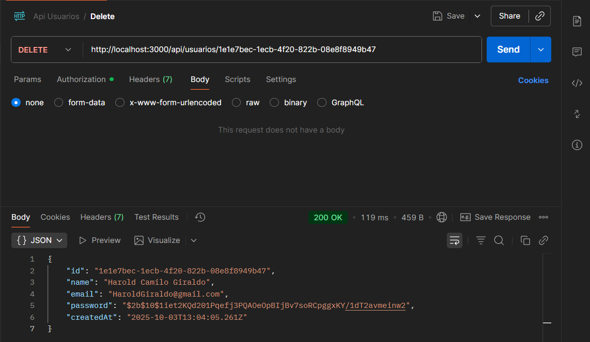
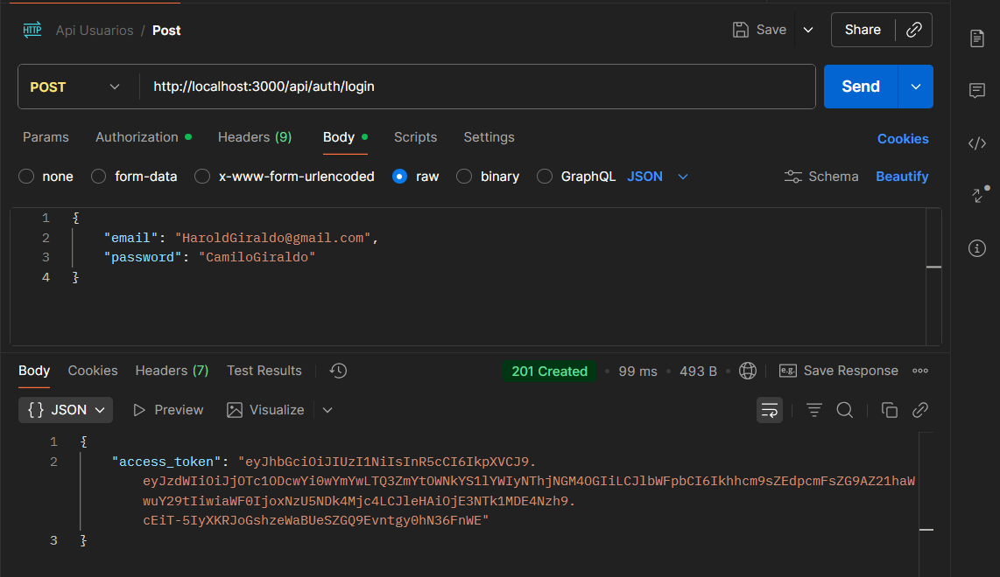
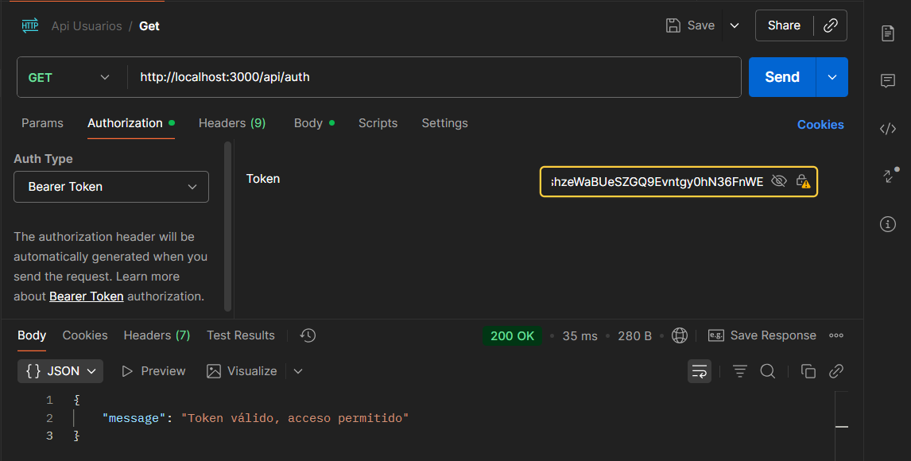

# Documentación De Los Endpoints 

##  Descripción de la API

La **API de Usuarios** es un servicio REST desarrollado con **NestJS** y **Prisma** que permite gestionar usuarios y autenticar sesiones de manera segura.

Incluye las operaciones básicas de un CRUD:

- Crear usuarios
- Listar usuarios
- Obtener usuario por ID
- Actualizar usuarios
- Eliminar usuarios

Además, implementa un sistema de **autenticación con JWT** para proteger los endpoints privados.

### Seguridad
- Las contraseñas se almacenan de forma segura utilizando **bcrypt**.
- Los endpoints privados están protegidos mediante **JWT Guards** (`@UseGuards(AuthGuard('jwt'))`) que es una dependencia que controla el acceso a la información.
- Cada usuario tiene un **UUID** como identificador único.
- Se registra automáticamente la **fecha de creación** de cada usuario.

### Propósito
Esta API está diseñada para ser consumida por **aplicaciones móviles o clientes web**, siguiendo principios de arquitectura **cliente-servidor** y aplicando **buenas prácticas de desarrollo backend**.

## Diseño de la API
### Entidad

##  Endpoint: Crear Usuario
- **POST** `http://localhost:3000/api/usuarios` → Crear usuario.

Permite registrar un nuevo usuario en la base de datos con los campos nombre, correo electrónico y contraseña el id no porque se ingresa por defecto con la propiedad @default(uuid()) de prisma  y la fecha_creacion se ingresa por defecto en la base de datos con la solicitud de prisma a la base de datos.  
La contraseña se cifra automáticamente con **bcrypt** antes de almacenarse.

#### Cuerpo de la Solicitud (Request Body)
El servidor espera un objeto JSON con el name, email y password del nuevo usuario.

JSON

{
  "name": "Harold Camilo Barrera Giraldo",
  "email": "CamiloGiraldo@gmail.com",
  "password": "Camilo123"
}
### Evidencia en Postman

## Endpoint: Listar Usuarios
- **GET** `http://localhost:3000/api/usuarios` → Listar usuarios. 

Permite obtener todos los usuarios registrados en la base de datos.  
Cada usuario incluye su identificador único (`id`), nombre, correo electrónico y contraseña cifrada y fecha_creacion.  

### Evidencia en Postman

## Endpoint: Obtener Usuario por ID
- **GET** `http://localhost:3000/api/usuarios/id ` → Obtener usuario por ID.

Permite consultar la información de un usuario específico a partir de su **ID único**.  
Devuelve un objeto con los datos del usuario solicitado.  

### Evidencia en Postman

## Endpoint: Actualizar Usuario
- **PUT** `http://localhost:3000/api/usuarios/id ` → Actualizar datos de usuario. 

Permite modificar los datos de un usuario existente en la base de datos a partir de su **ID único**.  
Los cambios incluyen nombre, correo electrónico y contraseña (la cual se vuelve a cifrar con **bcrypt** antes de guardarse).

#### Cuerpo de la Solicitud (Request Body)
Se utiliza para enviar los datos que se desean modificar.

JSON

{
  "name": "Harold Camilo Giraldo",
  "email": "HaroldGiraldo@gmail.com",
  "password": "CamiloGiraldo"
}
### Evidencia en Postman

## Endpoint: Eliminar Usuario

- **DELETE** `http://localhost:3000/api/usuarios/id ` → Eliminar un usuario.

Esta operación permite **eliminar permanentemente** un usuario de la base de datos utilizando su **ID único** como parámetro en la URL.

El código de estado **`200 OK`** indica que la eliminación se realizó con éxito. En esta implementación, el servidor responde devolviendo el objeto del usuario que acaba de ser eliminado.

---

### Evidencia en Postman

---

## Módulo de Autenticación (JWT)

El módulo de autenticación gestiona la creación de sesiones seguras. Utiliza un **JSON Web Token (JWT)** para verificar la identidad del usuario en cada solicitud a los *endpoints* protegidos.

### 1. Endpoint: Iniciar Sesión (Login)

- **POST** `http://localhost:3000/api/auth/login` → Inicia sesión y genera un token.

Permite a un usuario autenticarse en el sistema enviando sus credenciales (email y password). Si las credenciales son válidas, el servidor responde con un código **`201 Created`** y un **`access_token` (JWT)** que debe usarse para acceder a rutas protegidas.

### Evidencia en Postman: Solicitud de Token

### 2. Endpoint: Prueba de Token (Ruta Protegida)

- **GET** `http://localhost:3000/api/auth` → Verifica la validez del token.

Este *endpoint* ejemplifica cómo se consume una **ruta protegida** que requiere autenticación. El acceso es concedido solo si el **Token JWT** se envía correctamente en el encabezado de la solicitud.

#### Mecanismo de Uso del Token

Para acceder, se debe configurar el encabezado **`Authorization`** con el esquema **`Bearer`** seguido del token obtenido en el *login*.

**Header:**
### Evidencia en Postman: Acceso Permitido

La respuesta **`200 OK`** confirma que el token es **válido** y el acceso al recurso protegido es exitoso.

## ¿Qué ventajas ofrece separar frontend y backend?

### 1. Independencia y Desarrollo Paralelo 

**Desarrollo Simultáneo:**  
Los equipos de backend y de aplicaciones móviles (iOS/Android) pueden trabajar de manera independiente y simultánea. Una vez que la API (**Application Programming Interface**) del backend está definida (los contratos), las apps móviles pueden empezar a construir pantallas usando datos simulados (mocks), mientras el backend implementa la lógica real. Esto acelera el tiempo de desarrollo general.  

**Tecnologías Optimizadas:**  
Cada capa puede usar el stack más adecuado: el backend puede estar en **Node.js**, **Python** o **Java**, mientras que el frontend móvil puede desarrollarse con **Swift** (iOS), **Kotlin** (Android) o con frameworks híbridos como **Flutter** o **React Native**, sin forzar un mismo lenguaje.  

---

### 2. Escalabilidad y Rendimiento 

**Escalado Individual:**  
Si la app crece en usuarios, se puede escalar el backend de forma independiente (más servidores, base de datos distribuida, microservicios) sin tener que modificar la aplicación móvil. A su vez, la app puede optimizar el rendimiento local usando técnicas como almacenamiento en caché o sincronización offline.  

**Mejor Experiencia de Usuario:**  
El frontend móvil se enfoca en la interfaz y la fluidez de la aplicación (animaciones, navegación, interacciones), mientras que el backend se encarga de la lógica pesada y procesamiento de datos.  

---

### 3. Flexibilidad y Mantenimiento 

**Fácil Reemplazo de Interfaces:**  
Si se decide migrar de una app nativa a una híbrida (por ejemplo, de **Kotlin/Swift** a **Flutter**) o añadir una versión web, el backend permanece intacto siempre que conserve el mismo contrato de API.  

**Mantenimiento Simplificado:**  
Los errores se aíslan mejor. Si falla la lógica de negocio, está en el backend; si el problema es visual o de interacción, está en la app.  

**Múltiples Clientes:**  
Un mismo backend puede servir datos a:  
- Una app iOS  
- Una app Android  
- Una aplicación web  
- Otras apps externas  

Reutilizando la lógica y seguridad en todos los clientes.  

---

### 4. Seguridad Reforzada 

**Protección de Datos Sensibles:**  
La lógica de negocio y las credenciales de la base de datos no se exponen en la app. La comunicación se hace con **tokens** seguros (ej: **JWT**) y protocolos como **HTTPS**.  

**Validación del Lado del Servidor:**  
Aunque la app puede validar formatos básicos (ej: emails, contraseñas), el backend asegura la consistencia y seguridad real de los datos, impidiendo manipulaciones maliciosas.  

## ¿Cómo mejora la seguridad el uso de JWT? 

### 1. **Autenticación sin exponer credenciales**  
   - El usuario envía sus credenciales (usuario/contraseña) solo una vez para obtener el token.  
   - En cada petición posterior, se envía únicamente el **JWT**, no las credenciales.  

### 2. **Firmado digital**  
   - El token está **firmado** (con HMAC o RSA).  
   - Esto garantiza la **integridad**: el cliente no puede modificar el token sin que el servidor lo detecte.  

### 3. **Sin sesiones en el servidor**  
   - JWT es *stateless*: no necesita almacenar sesiones en memoria o base de datos.  
   - Reduce riesgos de ataques como secuestro de sesión.  

### 4. **Expiración y control de acceso**  
   - Los tokens incluyen un tiempo de expiración (`exp`), lo que limita su uso si son robados.  
   - Pueden contener roles o permisos para controlar el acceso de cada usuario.  

### 5. **Transmisión segura**  
   - Se envían sobre **HTTPS**, evitando que el token viaje en texto plano.  

En conclusión **JWT aumenta la seguridad al reemplazar credenciales permanentes por tokens firmados, temporales y verificables**.

## ¿Qué problemas podrías tener si no documentas tu API? 

### 1. **Dificultad para los desarrolladores**  
   - Los equipos que usen la API no sabrán qué endpoints existen, qué parámetros aceptar o qué datos devolver.  
   - Aumenta la curva de aprendizaje y la dependencia de preguntar al equipo original.  

### 2. **Errores de implementación**  
   - Los clientes pueden enviar datos mal formateados o incompletos.  
   - Se incrementa el riesgo de bugs por falta de ejemplos claros de uso.  

### 3. **Mantenimiento complejo**  
   - Con el tiempo, nadie recordará con exactitud cómo funciona la API.  
   - Pequeños cambios en el backend pueden romper integraciones sin que otros lo noten.  

### 4. **Menor productividad**  
   - El equipo pierde tiempo leyendo código o probando manualmente en lugar de consultar documentación.  
   - La integración con nuevas aplicaciones se vuelve más lenta.  

### 5. **Dificultad para la colaboración externa**  
   - Si terceros (partners, apps externas) quieren usar tu API, necesitarán explicaciones adicionales.  
   - Esto limita la adopción y reduce el valor de la API.  

En conclusión **sin documentación, la API se vuelve difícil de entender, mantener, integrar y escalar**.

