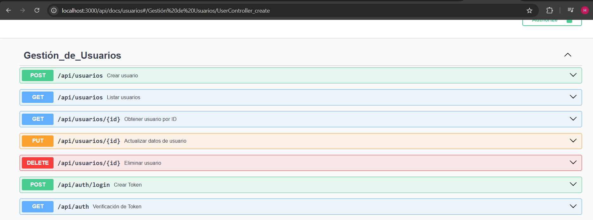
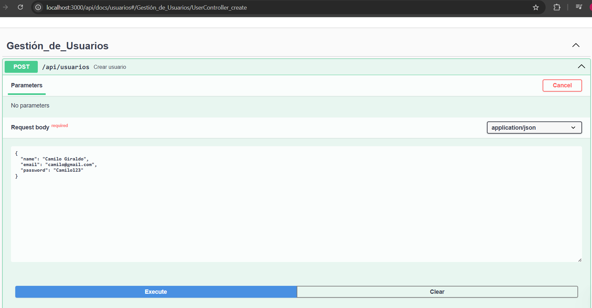
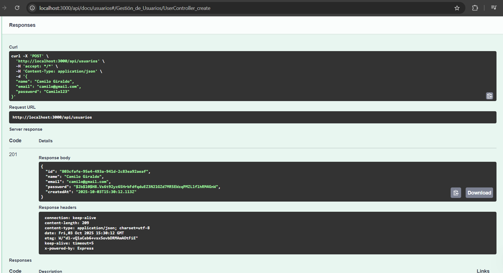
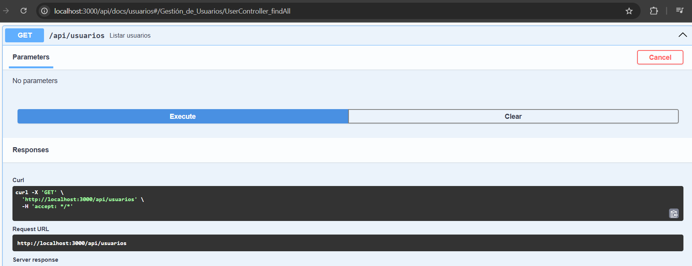
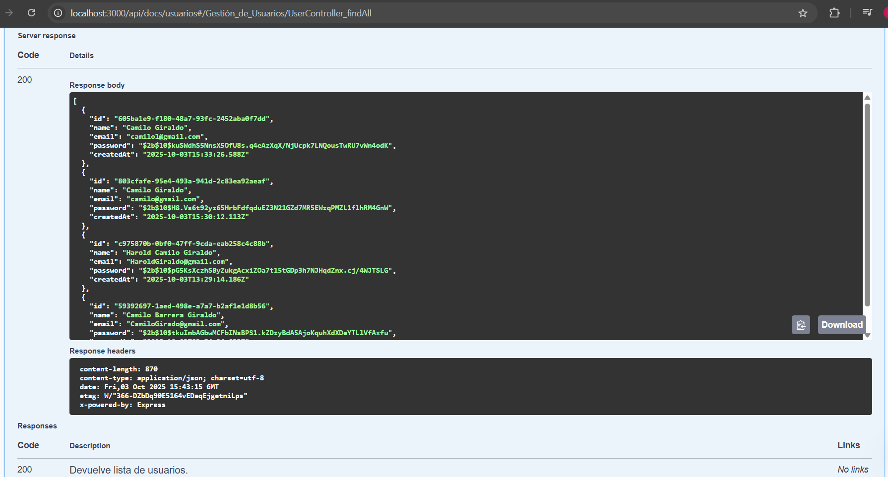
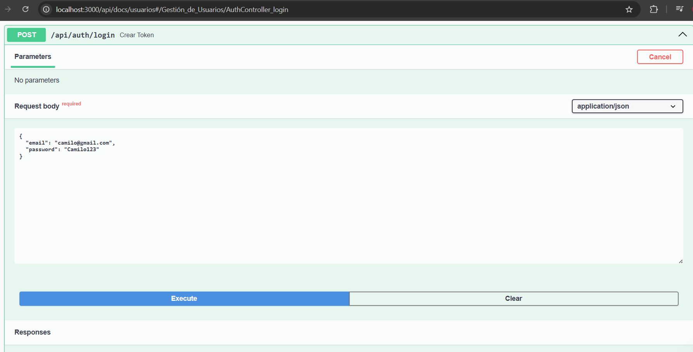
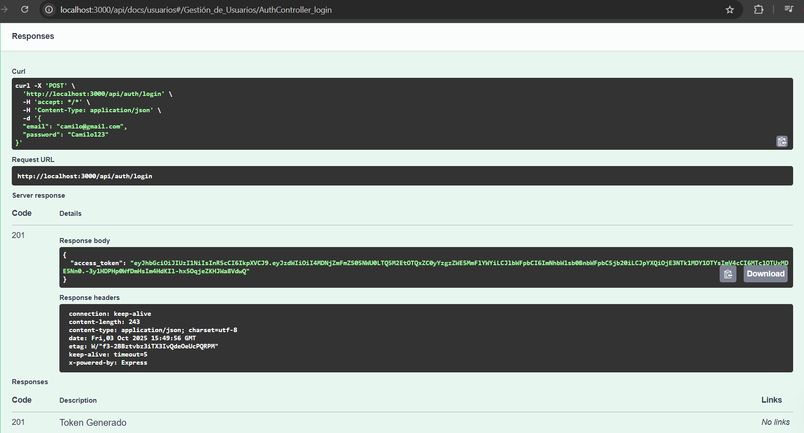

# Documentación De Los Endpoints 

##  Descripción de la API

La **API de Usuarios** es un servicio REST desarrollado con **NestJS** y **Prisma** que permite gestionar usuarios y autenticar sesiones de manera segura.

Incluye las operaciones básicas de un CRUD:

- Crear usuarios
- Listar usuarios
- Obtener usuario por ID
- Actualizar usuarios
- Eliminar usuarios

Además, implementa un sistema de **autenticación con JWT** para proteger los endpoints privados.

### Seguridad
- Las contraseñas se almacenan de forma segura utilizando **bcrypt**.
- Los endpoints privados están protegidos mediante **JWT Guards** (`@UseGuards(AuthGuard('jwt'))`) que es una dependencia que controla el acceso a la información.
- Cada usuario tiene un **UUID** como identificador único.
- Se registra automáticamente la **fecha de creación** de cada usuario.

### Propósito
Esta API está diseñada para ser consumida por **aplicaciones móviles o clientes web**, siguiendo principios de arquitectura **cliente-servidor** y aplicando **buenas prácticas de desarrollo backend**.

## Diseño de la API
### Entidad

## Endpoints

| Método | Endpoint | Descripción |
|--------|----------|-------------|
| `POST` | `/api/usuarios` | **Crear usuario** Registra un nuevo usuario en el sistema. |
| `GET`  | `/api/usuarios` | **Listar usuarios** Obtiene una lista de todos los usuarios registrados. |
| `GET`  | `/api/usuarios/{id}` | **Obtener usuario por ID** Recupera la información de un usuario específico utilizando su identificador único. |
| `PUT`  | `/api/usuarios/{id}` | **Actualizar datos de usuario** Modifica la información de un usuario existente. |
| `DELETE` | `/api/usuarios/{id}` | **Eliminar usuario** Elimina permanentemente un usuario del sistema. |
| `POST` | `/api/auth/login` | **Crear Token (Login)** Inicia sesión y genera un JSON Web Token (JWT) para autenticación. |
| `GET`  | `/api/auth` | **Verificación de Token** Permite verificar la validez de un token JWT para acceder a rutas protegidas. |

## Post api/usuarios
**Crear usuario**

### Respuesta

### Get api/usuarios

### Respuesta

## Post Token (Login)

### Respuesta

