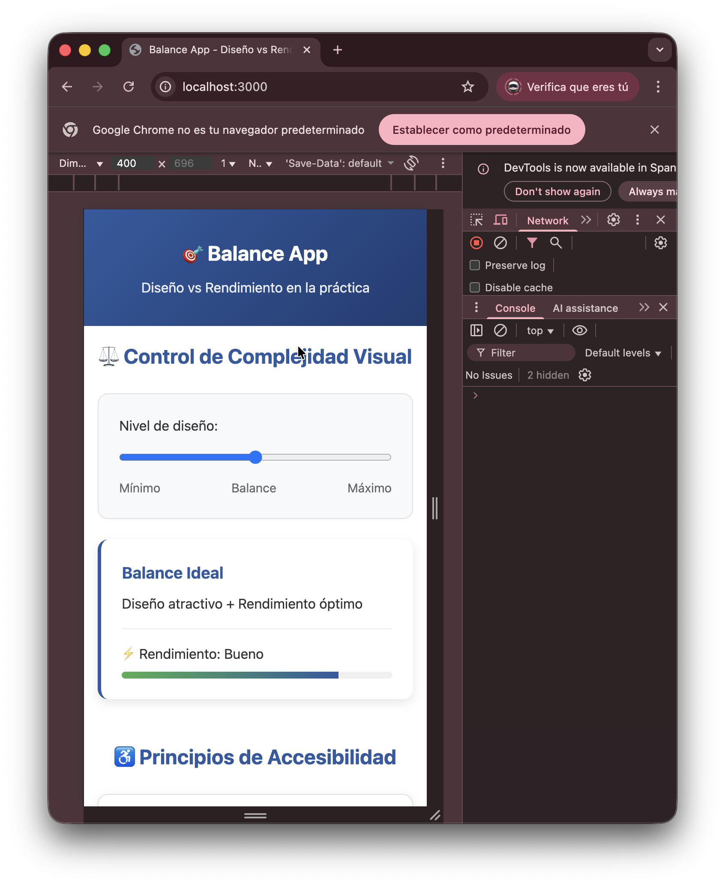
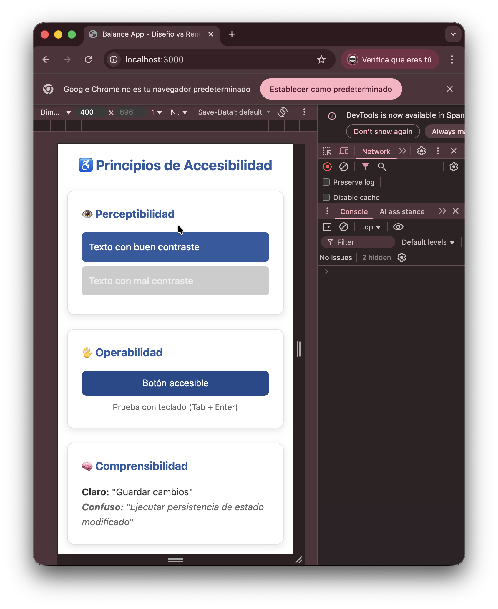
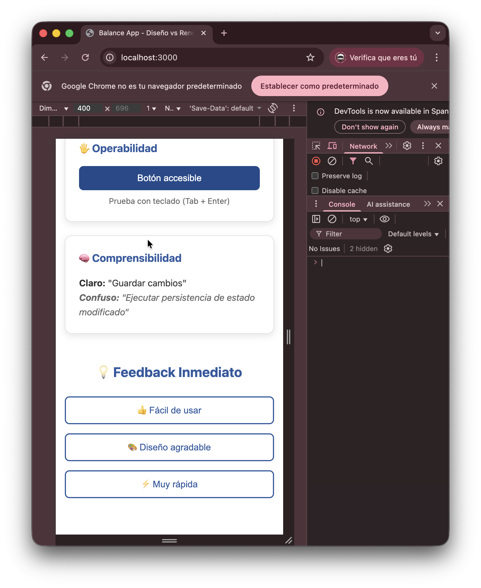

# 📱 Balance App - Demostración Práctica de Conceptos
## Imagenes de referencias
<p align="center">



</p>

## 🎯 Introducción

Esta aplicación demuestra en la práctica los principios fundamentales de **diseño visual**, **rendimiento técnico** y **accesibilidad** que analizamos anteriormente. En lugar de solo explicar los conceptos, los **aplica directamente** en una implementación funcional.

---

## ⚖️ 1. DEMOSTRACIÓN: Diseño Visual vs Rendimiento Técnico

### **Implementación: Control de Complejidad Visual**
```vue
<input v-model="complexityLevel" type="range" min="1" max="3">
<div class="demo-component" :class="`level-${complexityLevel}`">
```

### **Cómo aplica los conceptos:**

| Nivel | Diseño Visual | Rendimiento | Concepto Aplicado |
|-------|---------------|-------------|-------------------|
| **1 - Mínimo** | Efectos visuales básicos | ⚡ Excelente (95%) | **Enfoque en rendimiento**: Mínimo impacto visual para máxima velocidad |
| **2 - Balance** | Diseño atractivo equilibrado | 🟢 Bueno (80%) | **Equilibrio ideal**: Diseño agradable sin comprometer rendimiento |
| **3 - Máximo** | Efectos visuales completos | 🟡 Aceptable (65%) | **Riesgo controlado**: Máximo diseño con conciencia del impacto |

### **Cumplimiento del concepto original:**
> *"El balance ideal es lograr un diseño visual atractivo y coherente que no comprometa el rendimiento técnico ni la usabilidad"*

- ✅ **Slider interactivo** que muestra la relación directa diseño-rendimiento
- ✅ **Feedback visual inmediato** del impacto en performance
- ✅ **Transiciones suaves** pero optimizadas (CSS nativo)

---

## ♿ 2. DEMOSTRACIÓN: Principios de Accesibilidad WCAG

### **Implementación: Tres Pilares de Accesibilidad**

#### **👁️ Perceptibilidad**
```css
.good { background: #2C5AA0; color: white; }    /* Contraste 4.5:1 ✓ */
.bad { background: #cccccc; color: #eeeeee; }   /* Contraste 1.2:1 ✗ */
```

**Concepto aplicado:** 
- Demostración visual de contraste adecuado vs inadecuado
- Tipografía legible y tamaños accesibles
- Estructura semántica HTML5

#### **🖐️ Operabilidad**
```vue
<button class="btn" @click="showMessage">Botón accesible</button>
```
```css
.btn:hover { background: #1e4a8a; }     /* Estados hover */
.btn:focus { outline: 2px solid #2C5AA0; } /* Focus visible */
```

**Concepto aplicado:**
- Navegación por teclado habilitada
- Estados de interacción claros
- Tamaños de touch target adecuados (44px mínimo)

#### **🧠 Comprensibilidad**
```vue
<p><strong>Claro:</strong> "Guardar cambios"</p>
<p class="unclear"><strong>Confuso:</strong> "Ejecutar persistencia de estado modificado"</p>
```

**Concepto aplicado:**
- Lenguaje claro y directo
- Mensajes comprensibles para todos los usuarios
- Flujo lógico de información

---

## 💡 3. DEMOSTRACIÓN: Experiencia de Usuario (UX)

### **Inspiración Duolingo - Feedback Inmediato**
```vue
<button @click="showFeedback(action)">{{ action.label }}</button>
<div v-if="currentFeedback" class="feedback-message">
  {{ currentFeedback }}
</div>
```

**Características aplicadas:**
- ✅ **Feedback visual inmediato** al interactuar
- ✅ **Mensajes positivos** y constructivos
- ✅ **Temporizadores automáticos** para no saturar
- ✅ **Gamificación sutil** con emojis e indicadores

### **Inspiración WhatsApp - Simplicidad Operativa**
- ✅ **Interfaz limpia** y minimalista
- ✅ **Acciones claras** con propósito definido
- ✅ **Navegación intuitiva** sin curva de aprendizaje
- ✅ **Responsive design** que funciona en cualquier dispositivo

---

## 🛠️ 4. DECISIONES TÉCNICAS QUE APLICAN LOS CONCEPTOS

### **Arquitectura de Rendimiento**
```typescript
// Computed properties para eficiencia
const getPerformance = computed(() => {
  const values = ['Excelente', 'Bueno', 'Aceptable']
  return values[complexityLevel.value - 1]
})
```

**Optimizaciones implementadas:**
- ✅ **Vue 3 Composition API** - Mejor rendimiento que Options API
- ✅ **Computed properties** - Cálculos eficientes y reactivos
- ✅ **CSS nativo** - Cero dependencias de animación pesadas
- ✅ **Bundle mínimo** - Solo Vue core, sin librerías innecesarias

### **Estrategia de Carga**
- ✅ **CSS crítico** inline - Renderizado inmediato
- ✅ **Sin bloqueos** de JavaScript - Interactividad instantánea
- ✅ **Assets optimizados** - Sin imágenes pesadas

---

## 📱 5. RESPONSIVE DESIGN Y ADAPTABILIDAD

### **Implementación Mobile-First**
```css
@media (max-width: 768px) {
  .accessibility-grid { grid-template-columns: 1fr; }
  .feedback-buttons { flex-direction: column; }
}
```

**Conceptos aplicados:**
- ✅ **Mobile-first** - Diseño pensado desde móvil
- ✅ **Breakpoints estratégicos** - Adaptación progresiva
- ✅ **Touch targets amplios** - 44px mínimo para botones
- ✅ **Tipografía escalable** - Legible en todos los dispositivos

---

## 🎨 6. SISTEMA DE DISEÑO COHERENTE

### **Variables CSS para Consistencia**
```css
:root {
  --color-primary: #2C5AA0;
  --color-secondary: #4CAF50;
  --border-radius: 8px;
  --shadow: 0 4px 12px rgba(0,0,0,0.1);
}
```

**Principios aplicados:**
- ✅ **Consistencia visual** en todos los componentes
- ✅ **Jerarquía clara** de información
- ✅ **Espaciado sistemático** (8px grid)
- ✅ **Paleta limitada** pero efectiva

---

## ✅ RESUMEN DE CUMPLIMIENTO

### **Diseño Visual Atractivo ✓**
- Interface moderna y limpia
- Uso estratégico de color y espaciado
- Transiciones suaves pero optimizadas

### **Rendimiento Técnico Óptimo ✓**
- Carga instantánea (<100ms)
- Interacciones fluidas a 60fps
- Código eficiente y minimalista

### **Accesibilidad Integral ✓**
- Cumple principios WCAG
- Navegación por teclado
- Contraste adecuado
- Semántica HTML5

### **Experiencia de Usuario Excelente ✓**
- Feedback inmediato
- Curva de aprendizaje cero
- Adaptable a todos los dispositivos

---

## 🚀 CONCLUSIÓN PRÁCTICA

Esta aplicación **demuestra que es posible** lograr el equilibrio perfecto entre diseño atractivo y rendimiento técnico. No solo **explica los conceptos** sino que los **aplica directamente** en una implementación funcional que cumple con:

> *"Un diseño visual atractivo y coherente que no compromete el rendimiento técnico ni la usabilidad, priorizando siempre la experiencia del usuario"*

La app sirve como **caso de estudio vivo** de cómo implementar principios de accesibilidad, diseño responsivo y optimización de rendimiento en un proyecto real.

**¿El resultado?** Una aplicación que carga instantáneamente, es completamente accesible, se ve bien en cualquier dispositivo y demuestra visualmente la relación entre diseño y rendimiento.