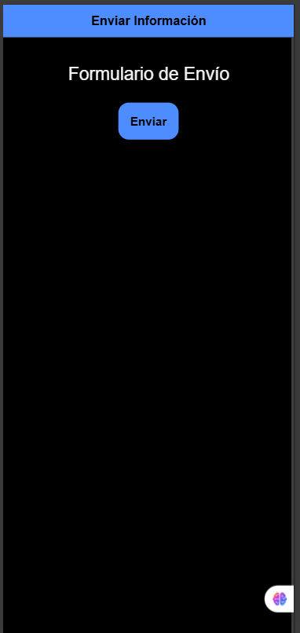

#  Errores de diseño en aplicaciones diarias

##  Planteamiento

Los errores de diseño en apps diarias suelen centrarse en tres ejes principales:

1. **Sobrecarga visual:** demasiados elementos en pantalla.  
2. **Falta de accesibilidad:** contrastes bajos o fuentes pequeñas.  
3. **Ausencia de retroalimentación:** sin respuesta visible al realizar una acción.  

Para mejorarlos, se pueden aplicar prácticas simples pero efectivas:  
- Implementar layouts más limpios y consistentes.  
- Utilizar alertas o animaciones sutiles para confirmar acciones.  
- Seguir las guías WCAG para accesibilidad.  
- Realizar pruebas de usabilidad con usuarios reales.

---

##  Ejemplo (código) — Botón accesible con feedback y contraste mejorado (Ionic React)

```tsx
import React, { useState } from 'react';
import { IonButton, IonContent, IonPage, IonSpinner, IonText, IonHeader, IonTitle, IonToolbar } from '@ionic/react';

const Home: React.FC = () => {
  const [cargando, setCargando] = useState(false);

  const enviar = () => {
    setCargando(true);
    setTimeout(() => setCargando(false), 1500); // Simula proceso
  };

  return (
    <IonPage>
      <IonHeader>
        <IonToolbar color="primary">
          <IonTitle>Enviar Información</IonTitle>
        </IonToolbar>
      </IonHeader>
      <IonContent className="ion-padding" fullscreen>
        <IonText color="dark">
          <h2 style={{ textAlign: 'center', marginBottom: '20px' }}>Formulario de Envío</h2>
        </IonText>

        <div style={{ display: 'flex', justifyContent: 'center' }}>
          <IonButton
            color={cargando ? 'success' : 'primary'}
            onClick={enviar}
            aria-label="Botón para enviar información"
            expand="block"
            style={{ maxWidth: '200px', height: '45px', fontWeight: 600 }}
          >
            {cargando ? <IonSpinner name="crescent" /> : 'Enviar'}
          </IonButton>
        </div>
      </IonContent>
    </IonPage>
  );
};

export default Home;
```

💬 *Este ejemplo soluciona un error típico: cuando un botón no da feedback visual. En Ionic React, el botón cambia de color y muestra un spinner, lo que brinda claridad y refuerza la percepción de acción completada.*

 
---


