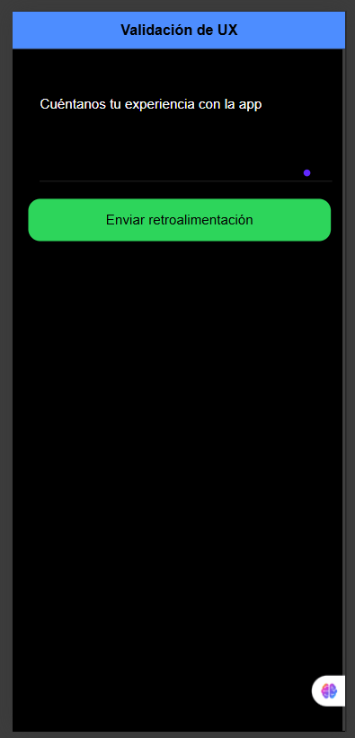

#  Estrategias para validar una buena experiencia de usuario

##  Planteamiento

Para validar si una app realmente ofrece una buena experiencia de usuario (UX), es fundamental **observar y medir el comportamiento real de los usuarios**.  
La validación debe combinar análisis **cualitativo** (cómo se sienten los usuarios) y **cuantitativo** (qué métricas reflejan su experiencia).

### Estrategias principales:
1. **Pruebas de usabilidad:** observar cómo los usuarios completan tareas.  
2. **Encuestas integradas:** recopilar opiniones directamente desde la app.  
3. **Analítica de interacción:** rastrear clics, tiempos y errores.  
4. **A/B testing:** comparar dos versiones y medir cuál ofrece mejor rendimiento.  
5. **Métricas clave:** tasa de retención, satisfacción (CSAT), y puntaje SUS.  

Estas acciones deben repetirse periódicamente, especialmente después de cada actualización, para garantizar que las mejoras realmente optimicen la experiencia y no introduzcan nuevos problemas.

---

##  Ejemplo (código) — Implementación de feedback del usuario en Ionic React

```tsx
import React, { useState } from 'react';
import { IonPage, IonHeader, IonToolbar, IonTitle, IonContent, IonItem, IonLabel, IonTextarea, IonButton, IonAlert } from '@ionic/react';

const Home: React.FC = () => {
  const [feedback, setFeedback] = useState('');
  const [showAlert, setShowAlert] = useState(false);

  const enviarFeedback = () => {
    if (feedback.trim().length > 0) {
      setShowAlert(true);
      setFeedback('');
    }
  };

  return (
    <IonPage>
      <IonHeader>
        <IonToolbar color="primary">
          <IonTitle>Validación de UX</IonTitle>
        </IonToolbar>
      </IonHeader>

      <IonContent className="ion-padding">
        <IonItem>
          <IonLabel position="floating">Cuéntanos tu experiencia con la app</IonLabel>
          <IonTextarea
            value={feedback}
            onIonChange={(e) => setFeedback(e.detail.value!)}
            rows={5}
            autoGrow={true}
            aria-label="Campo de texto para feedback de usuario"
          ></IonTextarea>
        </IonItem>

        <IonButton expand="block" color="success" onClick={enviarFeedback} style={{ marginTop: '20px' }}>
          Enviar retroalimentación
        </IonButton>

        <IonAlert
          isOpen={showAlert}
          onDidDismiss={() => setShowAlert(false)}
          header="¡Gracias!"
          message="Tu opinión ha sido enviada correctamente."
          buttons={['Aceptar']}
        />
      </IonContent>
    </IonPage>
  );
};

export default Home;
```

💬 *Este ejemplo muestra una forma sencilla de recopilar feedback del usuario directamente desde la app. Este tipo de componente ayuda a medir la percepción del usuario sobre la experiencia, generando datos cualitativos para mejorar el diseño.*

 

---